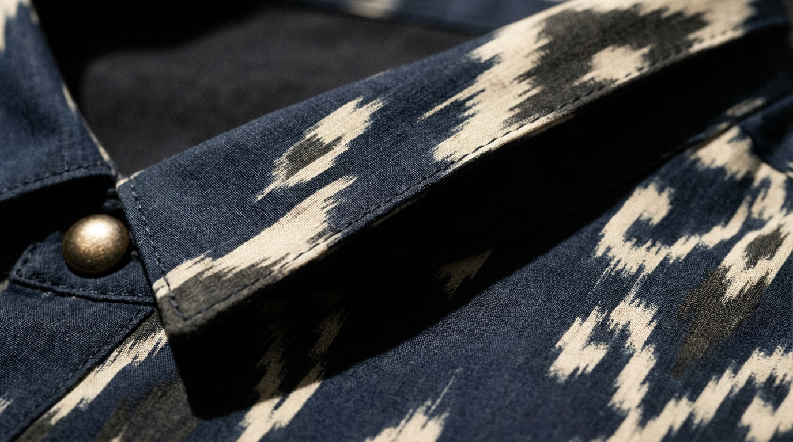

<br>

# ✦ RUMAH MODE ✦

## ROSEMARY LEGOH

### *Monografi Strategis Definitif*

**Disiapkan untuk Judy Rosemary Legoh - Maret 2026**

<div style="page-break-after: always;"></div>

---


---

<br>
<br>

## ✦ DAFTAR ISI ✦

<br>

**FASE I — IDENTITAS BERDAULAT** .............. *Penamaan, Persona & Komunitas*
- 1.1 Modul Penamaan: Identitas & Prestise
- 1.2 Filter Presisi Persona
- 1.3 Otoritas Ceruk & Suara Komunitas

**FASE II — TANDA TANGAN ARSITEKTURAL** .............. *Logo, Lipatan & Arahan Seni*
- 2.1 Lambang Arsitektural: Rangkaian Logo
- 2.2 Anatomi Lipatan RL
- 2.3 Visualisasi Tampilan Khas
- 2.4 Lembar Panduan Penceritaan Visual

**FASE III — KECERDASAN MATERIAL** .............. *Kain, Standar & Kisi Tenun*
- 3.1 Pengadaan Kain & Standar Keberlanjutan
- 3.2 Pagar Pengaman Kualitas Operasional

**FASE IV — EKONOMI KELANGKAAN** .............. *Harga, Inventaris & Ritual*
- 4.1 Ekonomi Unit Berbasis Kelangkaan
- 4.2 Inventaris & Logika Drop
- 4.3 Unboxing sebagai Ritual
- 4.4 Strategi Pemasaran Daftar Tunggu

**FASE V — RUMAH PERMANEN** .............. *Retensi, Strategi Digital & Pertahanan*
- 5.1 Pitch Influencer Lingkaran Dalam
- 5.2 Lingkaran Retensi Sentuhan Tinggi
- 5.3 Cetak Biru Digital Omnichannel
- 5.4 Pembandingan Kompetitor & Analisis Ruang Kosong
- 5.5 Uji Tekanan Strategis

**LAMPIRAN — LEMBAR PEMBUATAN GAMBAR** .............. *16 Prompt untuk Midjourney / DALL-E*

---

<div style="page-break-after: always;"></div>

# FASE I

# IDENTITAS BERDAULAT

### *Penamaan, Persona & Komunitas*

<br>

> *Sebelum satu helai benang dipotong, sebelum satu lipatan ditekan ke kain, sebuah rumah harus mengenal namanya sendiri. Fase I membangun tiga pilar yang menjadi tumpuan seluruh arsitektur berikutnya: apa nama merek ini, kepada siapa ia berbicara, dan bagaimana caranya berbicara.*

<br>


<div style="page-break-after: always;"></div>

## 1.1 MODUL PENAMAAN: IDENTITAS & PRESTISE

<br>

### Pertanyaan

***"Bertindaklah sebagai Konsultan Penamaan Merek Kelas Atas untuk pasar 'Quiet Luxury' Asia Tenggara. Ubah nama 'JR Collection' (Pemilik: Judy Rosemary Legoh) agar mengevoikasi inovasi struktural dan warisan. Hindari 'JR' (asosiasi masa kecil) dan 'Collection' (generik). Eksplorasi nama belakang 'Legoh' — kualitas fonetis ritmis dan arsitekturalnya. Berikan 10 opsi dalam jalur 'Atelier,' 'Warisan Abstrak,' dan 'Matriark Modern.' Sertakan Rasional Merek dan Tagline Visual untuk masing-masing."***

<br>

### Cetak Biru

---

### Arsitektur Fonetis "Legoh"

Sebelum opsi penamaan apa pun dipertimbangkan, analisis forensik atas nama belakang ini mengungkapkan mengapa **"Legoh"** merupakan aset merek yang benar-benar kuat.

| Kualitas Fonetis | Analisis | Implikasi Merek |
|---|---|---|
| **Awalan "Le-"** | Menggemakan kode kemewahan Prancis (*Le Labo, Le Bon Marché*) tanpa bersifat turunan | Persepsi *mewah* instan |
| **Akhiran "-goh"** | Hentakan keras dan bersih — seperti sudut arsitektural. Tegas. Final. | Mengomunikasikan **struktur & kepercayaan diri** |
| **Jumlah suku kata** | 2 suku kata (Le · Goh) | Optimal untuk branding mewah — cukup pendek untuk dimiliki, cukup panjang untuk terasa disengaja |
| **Kualitas ritmis** | Tekanan jatuh pada suku kata *kedua* (le-**GOH**) | Menciptakan *otoritas* alami — tekanan mendarat, ia *menutup* seperti sebuah tanda tangan |
| **Ambiguitas budaya** | Tidak terdengar eksklusif Barat maupun eksklusif lokal | Sempurna untuk Quiet Luxury Asia Tenggara — *glokal* secara alamiah |

> **Kesimpulan Strategis:** "Legoh" saja sudah mampu membawa sebuah merek mewah. Yang dibutuhkan adalah *bingkai* yang tepat — bukan deskriptor, melainkan *kata konteks* yang mengangkatnya.

---

### Tiga Jalur Penamaan, Sepuluh Opsi

**Jalur I — Atelier** *("Tangan yang Membuat")*

| # | Nama | Tagline Visual |
|---|---|---|
| 01 | **Legoh Atelier** | *"Struktur adalah bentuk kecantikan yang paling intim."* |
| 02 | **Maison Legoh** | *"Sebuah rumah dibangun sekali. Sebuah gaya dibangun selamanya."* |
| 03 | **Legoh Studio** | *"Setiap lipatan dimulai sebagai pertanyaan."* |

**Jalur II — Warisan Abstrak** *("Akar Dibuat Tak Terlihat, Kekuatan Dibuat Terasa")*

| # | Nama | Tagline Visual |
|---|---|---|
| 04 | **Rengga** | *"Ruang antara struktur dan keindahan — di situlah kami tinggal."* |
| 05 | **Legoh Wira** | *"Berpakaian dengan keberanian dari mereka yang datang sebelumnya."* |
| 06 | **Sulam** | *"Dijalin dengan memori. Dikenakan menuju masa depan."* |
| 07 | **Legoh Karsa** | *"Kehendak adalah benang pertama. Yang lainnya mengikuti."* |

**Jalur III — Matriark Modern** *("Namanya. Aturannya. Warisannya.")*

| # | Nama | Tagline Visual |
|---|---|---|
| 08 | **Rosemary Legoh** | *"Ia mengingat dari mana ia berasal. Lalu ia menciptakan sesuatu yang baru."* |
| 09 | **Judy Legoh** | *"Bukan tren. Sebuah tanda tangan."* |
| 10 | **The Legoh** | *"Ada banyak nama. Hanya ada satu Legoh."* |

---

### Rekomendasi Strategis

| Prioritas | Nama | Rasional |
|---|---|---|
| **Utama** | **Rosemary Legoh** | Abadi, dapat diraih, menceritakan kisah manusiawi, menua menjadi merek warisan. Lengkungan fonetis "Rosemary + Legoh" benar-benar indah. |
| **Pasar Segera** | **Legoh Atelier** | Hambatan terendah untuk pemahaman konsumen, langsung menandakan elevasi, praktis untuk e-commerce dan signage ritel. |
| **Visi Jangka Panjang** | **The Legoh** | Jika merek berkomitmen pada 3–5 tahun membangun kualitas dan konsistensi, ini menjadi nama paling *kuat* di ruangan mana pun. |

> *Sebuah nama bukan logo. Ia adalah keputusan pertama yang dibuat merek Anda — dan yang bergema di setiap ruangan yang dimasuki pelanggan Anda saat mengenakan karya Anda.*

---

<br>

<div style="page-break-after: always;"></div>

## 1.2 FILTER PRESISI PERSONA

<br>

### Pertanyaan

***"Bertindaklah sebagai Psikolog Konsumen yang berspesialisasi di pasar 'Urban Affluent' Indonesia. Ambil tiga persona inti (Arsitek Budaya, Modernis Ruang Rapat, dan Kurator Sosial) dan definisikan 'Pemicu Nilai' mereka. Identifikasi 3 'Kegelisahan Gaya' yang mereka miliki terhadap Wastra tradisional. Identifikasi isyarat estetik yang menandakan 'Kelas Atas' vs 'Pasar Massal.' Buat peta konten 'Sehari dalam Kehidupan' tentang bagaimana Rosemary Legoh masuk dalam ritual harian mereka."***

<br>

### Cetak Biru

---

### Persona I: Arsitek Budaya

**Profil:** Usia 34–48. Akademisi senior, kurator museum, direktur LSM budaya. Tinggal di Menteng, Kemang, atau area Dago Bandung. Lemari pakaiannya adalah tesis terkurasi, bukan laporan tren.

**Kegelisahan Gaya terhadap Wastra Tradisional:**

| Kegelisahan | Ketakutan Mendasar |
|---|---|
| **"Terlalu Seremonial"** — takut mempertunjukkan warisan alih-alih *menghidupinya* | Ketidakautentikan dalam identitasnya sendiri |
| **"Siluet yang Pasif Secara Intelektual"** — outer batik standar terasa secara struktural "diam" | Pakaian melemahkan gravitas profesional di ruang yang didominasi Barat |
| **"Motif yang Diproduksi Massal"** — sangat sadar bahwa motifnya mungkin dijual 500 unit di Tanah Abang | Terekspos sebagai tidak diskriminatif oleh komunitas yang ia pimpin |

**Sinyal Kelas Atas yang Langsung Ia Baca:**
- Elemen struktural yang mereferensikan sejarah seni — lipatan asimetris, kerah dekonstruksi — yang bisa ia *narasi*kan kepada rekan-rekannya
- Kain dengan variasi tenunan tangan yang tampak, membuktikan bahwa itu bukan hasil tenun massal
- Branding minimal atau tidak terlihat — label adalah rahasia; desain adalah tanda tangan
- Kisah provenance yang dapat diverifikasi — ia akan bertanya "Atelier mana? Keluarga penenun mana?"

---

### Persona II: Modernis Ruang Rapat

**Profil:** Usia 28–42. Eksekutif C-suite, pendiri startup, atau konsultan senior. Berbasis di SCBD atau Sudirman. Titik referensinya global: ia membandingkan Jakarta dengan Singapura dan Seoul.

**Kegelisahan Gaya terhadap Wastra Tradisional:**

| Kegelisahan | Ketakutan Mendasar |
|---|---|
| **"Terbaca sebagai Tradisional, Bukan Strategis"** — blazer batik bisa menandakan "vendor lokal" alih-alih "rekan global" | Dipersepsikan kurang kosmopolitan dibanding rekan-rekannya |
| **"Kebingungan Kondangan"** — siluet tradisional diasosiasikan dengan seremoni, bukan bisnis | Pilihan gaya melemahkan konteks profesional |
| **"Potongan Tanpa Arsitektur"** — sebagian besar outer Wastra dipotong untuk kelembutan, bukan untuk power dressing | Terlihat tidak berbentuk di lingkungan visual berisiko tinggi |

**Sehari Bersama Rosemary Legoh:**
- **08:30** — Rapat dewan. Kerah Lipatan RL adalah pelindung struktural. Asimetri mengomunikasikan kecerdasan kreatif dalam bingkai formal.
- **13:00** — Makan siang dengan partner PE. Pilihan Wastra-nya memancing pertanyaan *"Itu dari mana?"* — keunggulan intelijen kompetitif.
- **21:00** — Bersantai, cek Instagram. Ia mencari *pengumuman drop berikutnya* agar bisa menjadi yang pertama.

---

### Persona III: Kurator Sosial

**Profil:** Usia 24–38. Direktur kreatif, kreator konten gaya hidup, konsultan merek. Berbasis di Menteng, Cipete, atau Bali. Identitasnya adalah estetikanya — dan estetikanya adalah mata uang profesionalnya.

**Kegelisahan Gaya terhadap Wastra Tradisional:**

| Kegelisahan | Ketakutan Mendasar |
|---|---|
| **"Terlalu Sering Dilakukan oleh Algoritma"** — setiap tampilan Wastra sudah dilakukan oleh 50 influencer bulan ini | Kebiasaan estetis di lingkungan di mana nilainya adalah keistimewaan estetis |
| **"Kemiskinan Narasi"** — karya non-eksklusif tidak punya cerita yang belum pernah diceritakan | Konten yang berkinerja buruk karena tidak memiliki jangkar unik |
| **"Efek Kostum"** — sangat sadar akan batas antara menata warisan dan mengkostumkan etnisitas | Dikritik oleh audiens yang cerdas budaya |

**Apa yang Rosemary Legoh Berikan Kepadanya:**
- Elemen yang terfoto *berbeda* dari setiap sudut — asimetri Lipatan RL menciptakan cerita visual baru di setiap bingkai
- Merek dengan *friksi dalam proses pembelian* — daftar tunggu, sistem DM-first, absennya tombol publik "Tambah ke Keranjang." Kelangkaan adalah konten itu sendiri.
- Desain busana bisa menjadi subjek Reel 90 detik tanpa bergantung pada wajah si pemakai

---

### Matriks Pemicu Nilai Lintas-Persona

| Pemicu Nilai | Arsitek Budaya | Modernis Ruang Rapat | Kurator Sosial |
|---|---|---|---|
| **Provenance** | Kritis — ia merisetnya | Moderat — ia menggunakannya sebagai konteks | Tinggi — itu caption-nya |
| **Lipatan RL** | Artefak intelektual | Siluet kekuasaan | Subjek fotografi |
| **Kelangkaan (30 unit)** | Memvalidasi eksklusivitas | Mengurangi risiko over-exposure | Menciptakan urgensi dan konten FOMO |
| **Kisah Warisan** | Motivasi inti | Aset percakapan | Infrastruktur naratif |

---

<br>


<div style="page-break-after: always;"></div>

## 1.3 OTORITAS CERUK & SUARA KOMUNITAS

<br>

### Pertanyaan

***"Bertindaklah sebagai Community Manager untuk merek warisan butik. Definisikan 'Suara Komunitas' untuk Rosemary Legoh yang berbicara kepada perempuan urban Indonesia yang menghargai 'Wastra Modern.' Berikan contoh penceritaan artisan di balik layar, cara memimpin diskusi gaya, dan cara membuat pelanggan merasa seperti 'Patron' dalam lingkaran dalam yang eksklusif."***

<br>

### Cetak Biru

---

### Pilar-Pilar Suara

| Pilar | Apa Itu | Apa yang Bukan |
|---|---|---|
| **Keakraban yang Terinformasi** | Berbicara seperti teman berpengetahuan yang kebetulan mengenal seorang penenun master | Menggurui. Merendahkan. |
| **Kepercayaan Diri yang Tenang** | Menegaskan nilai Lipatan RL tanpa pernah membelanya | Membual. Terlalu menjelaskan. |
| **Penghormatan Budaya** | Menghormati *ibu-ibu* pengrajin dan keahlian mereka sebagai otoritas sejati | Tokenisasi. Performatif. |
| **Inklusi Selektif** | Membuat komunitas merasa dipilih, bukan dipasarkan | Manipulasi FOMO. Spam. |

### Kosakata Milik

| Kata Milik | Makna dalam Konteks |
|---|---|
| **The Fold** (Lipatan) | Tanda tangan struktural Lipatan RL — inovasi inti merek |
| **Patron** | Sebutan untuk pelanggan kami — bukan "pembeli," "pengikut," atau "pelanggan" |
| **The Inner Circle** (Lingkaran Dalam) | Komunitas daftar tunggu / VIP |
| **Wastra** | Tekstil Indonesia — selalu digunakan dengan penghormatan |
| **The House** (Rumah) | Rosemary Legoh sebagai institusi |
| **A Drop** | Peluncuran koleksi baru |
| **Architectural** (Arsitektural) | Filosofi desain — struktur lebih dulu, motif kemudian |

---

### Penceritaan Artisan: Empat Format

**Format 1 — "Tangan Sang Pembuat"** *(Instagram Stories / Reels)*
Video close-up tangan pengrajin bekerja. Cahaya alami. Tanpa filter. Tanda tangan personal dari "Rosemary" (bukan akun merek) menghilangkan jarak antara pendiri dan komunitas.

> *"Ibu [Nama] telah melipat kain selama [X] tahun di [Kota]. Motif [motif] yang Anda lihat sedang dibentuk di sini akan menjadi Lipatan pada [Nama Drop]. Akan ada [jumlah] karya ini di dunia. — Rosemary"*

**Format 2 — "Buku Harian Material"** *(Instagram Feed Carousel)*
Perjalanan 5 slide dari bahan mentah ke karya jadi. Slide 4 adalah momen kritis: *"Ini momennya. Inilah mengapa ia tidak bisa ditiru."*

**Format 3 — "Kunjungan Asal Usul"** *(Reels atau YouTube Shorts)*
Observatif, bukan promosional. Tanpa dialog terskrip. Reaksi autentik dari kunjungan bengkel.

**Format 4 — "Catatan Ketidaksempurnaan"** *(Stories atau WhatsApp Broadcast)*
Ketika sebuah batch tertunda atau hasil produksi lebih sedikit dari yang direncanakan, beri tahu komunitas sebelum mereka bertanya: *"Kami lebih memilih merilis lebih sedikit daripada merilis yang salah. — Rosemary"*

---

### Tangga Privilese Patron

| Tingkat | Definisi | Apa yang Mereka Terima |
|---|---|---|
| **Daftar Tunggu** | Minat terdaftar, belum membeli | Tautan pembelian 24 jam sebelum publik |
| **Patron Pertama** | Menyelesaikan satu pembelian | Catatan terima kasih personal dari Rosemary |
| **Patron Kembali** | Dua atau lebih pembelian | Preview awal koleksi berikutnya. Akses langsung WhatsApp. |
| **Patron Rumah** | Kolektor 3+ karya | Diundang ke fitting privat. Hak penolakan pertama untuk karya made-to-order. Dicantumkan dalam arsip merek. |

---

<div style="page-break-after: always;"></div>

# FASE II

# TANDA TANGAN ARSITEKTURAL

### *Logo, Lipatan & Arahan Seni*

<br>

> *Fase II adalah batu penjuru visual Rumah ini. Di sini, otoritas abstrak yang dibangun pada Fase I diberi wujud — dalam sebuah logotype, dalam kerah struktural, dan dalam bahasa visual yang mengajarkan dunia cara melihat merek ini.*

<br>


<div style="page-break-after: always;"></div>

## 2.1 LAMBANG ARSITEKTURAL: RANGKAIAN LOGO

<br>

### Pertanyaan

***"Bertindaklah sebagai Direktur Kreatif. Rancang rangkaian logo untuk Rosemary Legoh. Estetika harus menyeimbangkan Arsitektur Modernis dengan referensi abstrak Wastra Indonesia. Hasilkan: 1) Logotype Utama dengan tipografi kustom 'terstruktur.' 2) Monogram Abstrak (The Mark) untuk hardware dan label. 3) Palet warna minimalis 'Tanah & Laut.' Berikan 3 konsep dengan rasional desain yang menjelaskan 'Tanda Tangan Arsitektural' masing-masing."***

<br>

### Cetak Biru

---

### Manifesto Pra-Desain

Dua bahasa visual harus saling menahan dalam ketegangan produktif di seluruh sistem identitas ini:

| Arsitektur Modernis | Wastra Indonesia |
|---|---|
| Geometri penahan beban — kolom, balok, ambang | Geometri sakral — lingkaran kawung, diagonal parang, segitiga tumpal |
| Presisi Swiss, ruang negatif sebagai logika struktural | Ritme tangan, ketidakreguleran manusiawi di tepi tenunan |
| **Grid** sebagai tindakan kontrol | **Tenun** sebagai tindakan devosi |
| **Keheningan antar elemen** | **Cerita di setiap helai benang** |

Mandatnya: temukan satu garis di mana denah lantai Mies van der Rohe dan *kain panjang* Jawa menempati napas visual yang sama.

---

### Konsep 01 — "Ambang Pintu"
**Tanda Tangan Arsitektural: Portal**

Logotype diapit oleh dua "pilar portal" vertikal — mereferensikan momen transisi yang presisi dari luar ke dalam dalam arsitektur Modernis, dan *seret* (garis batas vertikal) dalam *batik pagi-sore* Jawa. Nama menjadi pintu masuk.

**The Mark:** Dua goresan vertikal yang bergabung di dasar dengan satu goresan menurun tunggal — terbaca secara bersamaan sebagai huruf π, sebuah heddle tenun, dan ambang pintu dalam denah tampak atas.

**Palet — Edisi Threshold:**
- **Tanah Kapur** (#F5F0E8) — Batu Kapur. Putih hangat dengan kedalaman mineral.
- **Arang Kayu** (#1C1A17) — Arang Kayu. Dekat hitam, undertone hangat.
- **Laut Dalam** (#1E3040) — Laut Dalam. Dekat navy, dingin dan tenang.
- **Perunggu** (#A0845C) — Patina Perunggu. Aksen. Maksimal 8% dari komposisi mana pun.

---

### Konsep 02 — "Kolom Tenun"
**Tanda Tangan Arsitektural: Kolonade**

Dua nama disusun vertikal — ROSEMARY dan LEGOH sebagai kolom paralel. Komposisi mencerminkan tenunan *tenun ikat*, di mana benang lusi berjalan dalam kolom vertikal yang kencang. Titik awal yang tidak sejajar merepresentasikan kolom yang menanggung beban berbeda.

**The Mark:** Dua goresan vertikal dengan ketinggian tidak sama di atas dasar horizontal bersama — sebuah kolonade dalam kejujuran struktural tertingginya.

**Palet — Edisi Kolonade:**
- **Tanah Merah** (#3D2B1F) — Tanah Merah. Coklat terakota dalam.
- **Gading** (#F2ECE0) — Gading Tua. Lebih hangat dari putih, lebih dingin dari krem.
- **Laut Hijau** (#2D4A3E) — Laut Bakau. Hitam-hijau, kedalaman pesisir.
- **Emas Antik** (#C9A96E) — Emas Antik. Hangat, matte. Aksen hardware.

---

### Konsep 03 — "Grid Parang"
**Tanda Tangan Arsitektural: Bay Struktural**

"ROSEMARY" dilingkupi dalam kotak persegi panjang yang presisi — bay struktural. "LEGOH," diset lebih lebar di bawahnya, sengaja meluap dari kotak di atas — gerakan *parang rusak*: patahan sengaja dalam grid yang membawa makna terdalam.

**The Mark:** Persegi panjang terbuka yang sengaja bocor di dua titik terhitung. Dalam tradisi tekstil Indonesia, kain sakral tertentu sengaja dibiarkan dengan tepi yang belum selesai — *tumpal* ditangguhkan. Merek yang mengetahui kapan harus *tidak* menyelesaikan adalah merek yang telah menguasai keahliannya.

**Palet — Edisi Grid Parang:**
- **Tanah Putih** (#E8E2D9) — Tanah Liat Putih. Keheningan mineral.
- **Hitam Tinta** (#18140F) — Hitam Tinta. Hangat, mengandung coklat, bukan biru.
- Aksen **Benang Merah** untuk judul bagian.

<br>

<div style="page-break-after: always;"></div>

## 2.2 ANATOMI LIPATAN RL

<br>

### Pertanyaan

***"Bertindaklah sebagai Sejarawan Mode dan Perancang Struktural. Definisikan 'Anatomi Lipatan RL.' Jelaskan bagaimana kerah origami asimetris spesifik ini menjembatani lipatan 'wiron' Indonesia dengan arsitektur modernis. Berikan 'Manifesto Desain' yang menjelaskan mengapa struktur ini adalah inovasi yang unggul dibanding batik pola datar standar."***

<br>

### Cetak Biru

---

### Asal Usul: Sebuah Silsilah dari Dua Kecerdasan

**Akar Indonesia: Wiron sebagai Geometri Sakral**

*Wiron* adalah lipatan akordeon yang presisi dan repetitif yang diaplikasikan pada bagian depan hem *kain* Jawa. Setiap lipatan berjarak sama, berarah (selalu dilipat ke kiri), dan rata. Wiron adalah teknologi repetisi terkontrol. Ia adalah penghormatan yang diwujudkan. Dalam estetika keraton Jawa, lipatan wiron bukan dekoratif — ia bersifat *kosmologis*.

**Akar Barat: Strukturalisme Origami Modernis**

Pada 1959, Jørn Utzon memenangkan komisi Sydney Opera House dengan wahyu bahwa bidang datar, ketika diskor dan dirotasi sepanjang sumbu diagonal, menciptakan bentuk tiga dimensi dengan kekakuan struktural luar biasa. Prinsip ini mengalir melalui artikulasi beton Tadao Ando, lipatan parametrik Zaha Hadid, dan *Pleats Please* Issey Miyake. Lipatan asimetris adalah gestur paling canggih: ia menciptakan **ketegangan arah** — mata mengikuti garis lipatan seperti cakrawala.

---

### Lima Zona Struktural

> *Satu lipatan tunggal, non-cermin yang berawal dari klavikula kiri, melintasi secara diagonal sepanjang garis leher, dan terselesaikan di satu titik di bawah tulang belikat kanan — menciptakan bidang skultural kontinu yang berfungsi secara bersamaan sebagai kerah, lapel, dan fasad arsitektural.*

| Zona | Nama | Peran Struktural | Referensi Arsitektural |
|---|---|---|---|
| **1** | Asal (The Origin) | Jangkar di klavikula kiri | Bidang dasar / Fondasi |
| **2** | Diagonal (The Diagonal) | Lipatan utama di 34° | Sumbu rotasi cangkang Utzon |
| **3** | Puncak (The Peak/Apex) | Titik visual tertinggi di tengah-leher | Lengkungan penahan beban |
| **4** | Penurunan (The Descent) | Perjalanan ke belakang menuju bahu kanan | Bidang parametrik Hadid |
| **5** | Resolusi (The Resolution) | Jangkar tersembunyi di bawah skapula | Kantilever — ditahan oleh tegangan tak terlihat |

### Aturan 34 Derajat

Diagonal lipatan melintasi tepat pada **34 derajat** dari horizontal. Pada kurang dari 30°, ia terbaca sebagai cowl yang lembut. Pada lebih dari 40°, sebuah selendang draping. Pada 34°, lipatan berada di **titik manis tektonik**: sudut di mana bidang terlipat tampak sekaligus melayang dan permanen. Ini adalah logika sudut yang sama dengan struktur atap miring arsitektur *Rumah Gadang* Minangkabau.

<br>


---

### Manifesto Desain

**Masalah dengan Batik Pola Datar:**
1. Pakaian menggantung dari tubuh — tidak ada dialog antara struktur dan bentuk.
2. Motif batik diperlakukan sebagai wallpaper — diaplikasikan pada siluet yang sudah ada sebelumnya.
3. Semua pakaian batik pola datar terbaca sama dari kejauhan.
4. Tidak ada geometri proprietary. Penjahit mana pun bisa mereproduksinya.
5. Busana menua sebagai komoditas.

> Outer batik pola datar adalah **permukaan indah tanpa tulang punggung.**

**Apa yang Lipatan RL Berikan:**

- **Tanda tangan struktural proprietary.** Lipatan skor asimetris 34 derajat tidak bisa di-sketch-and-copy tanpa memahami sistem scoring internal, persyaratan tegangan kain, dan logika resolusi lima zona.
- **Dialog hidup antara tekstil dan struktur.** Ketika motif batik skala makro dipotong sepanjang garis lipatan, ia terinterupsi dan bertransformasi. Batik menjadi *material arsitektural*, bukan permukaan dekoratif.
- **Pembacaan spasial yang berubah.** Mata bergerak secara diagonal ke atas sepanjang garis lipatan. Tubuh dalam Lipatan RL adalah sebuah bangunan yang mengontrol garis pandang.
- **Menyelesaikan "Masalah Batik."** Tekstil tetap batik — kredensial budaya utuh. Struktur menegaskan modernitas arsitektural. Ia tidak harus memilih antara budayanya dan ambisinya.
- **Sistem desain yang tahan lama.** Tanda tangan arsitektural tidak memiliki tanggal kedaluwarsa. Kursi Eames bukan tren. Barcelona Pavilion bukan tren. Lipatan RL tidak bersaing dengan musim. **Ia mendahului mereka dan melampaui mereka.**

> *Kita berasal dari peradaban penenun. Kita berpikir seperti arsitek. Kita berpakaian seperti tidak keduanya — dan keduanya sekaligus.*

---

<br>


<div style="page-break-after: always;"></div>

## 2.3 VISUALISASI TAMPILAN KHAS

<br>

### Pertanyaan

***"Buat prompt foto editorial high-fashion untuk Midjourney/DALL-E dari model dalam outer Lipatan RL. Setting harus berupa lokasi 'orang dalam' (galeri seni Jakarta). Pencahayaan harus alami/tanpa filter untuk mempertahankan daya tarik 'Quiet Luxury.' Referensikan estetika Vogue Indonesia."***

<br>

### Cetak Biru

---

### Arsitektur Prompt: Empat Pilar

| Pilar | Apa yang Dikontrol |
|---|---|
| **Subjek** | Tipe model, energi pose, sikap |
| **Busana** | Deskripsi siluet Lipatan RL untuk akurasi AI |
| **Lokasi** | Setting orang dalam Jakarta, kedalaman latar |
| **Pencahayaan & Suasana** | Alami/tanpa filter — autentisitas Quiet Luxury |

### Prompt Kampanye Utama

> *Foto mode editorial seorang perempuan Indonesia di akhir usia 30-an, dengan energi yang tenang dan arsitektural, mengenakan outer mantel asimetris berkerah origami terstruktur dari sutra batik Jawa pewarnaan tangan — indigo dalam dan gading hangat — kerahnya terlipat menjauh dari leher dalam satu lipatan sudut dramatis (Lipatan RL), menghasilkan bayangan geometris lembut melintasi tulang selangka. Ia berdiri di galeri seni kontemporer Jakarta yang minimalis — dinding beton mentah, kaca dari lantai ke langit-langit menghadap dedaunan tropis. Cahaya sisi sore alami, tanpa filter. Ia memegang clutch kulit minimal, tanpa perhiasan kecuali satu gelang arsitektural. Ekspresi: tenang, tahu, tak terbantahkan hadir. Estetika Vogue Indonesia. Film format menengah. Netral hangat, bayangan desaturasi.*

### Seri Prompt Pendukung

**A — Seri Interior Galeri:**
- The Contemplative Stand (golden hour, Lipatan RL putih tulang, pengaruh Peter Lindbergh)
- The Artwork Dialogue (sudut samping, motif busana menggemakan lukisan abstrak)
- The Exit Frame (pertengahan langkah, lipatan terangkat dengan gerakan, rim light dari belakang)

**B — Seri Detail & Close-Up:**
- The Fold Architecture (makro sudut 45° konstruksi kerah)
- Hands & Fabric (tangan menutup kancing tersembunyi, kerah mengalir turun)

**C — Penceritaan Lingkungan:**
- The Courtyard Moment (batu berlumut, cahaya tropis bercorak)
- The Curator's Table (kafe, buku, cangkir keramik, energi candid)

### Bahasa Pencahayaan

| Setting | Sumber | Suasana |
|---|---|---|
| Interior Galeri | Sore hari melalui kaca | Hangat, berarah, bayangan panjang lembut |
| Halaman | Sinar matahari tersaring kanopi | Bercorak, organik, tekstur kontras tinggi |
| Bidikan Detail | Sumber lembut tunggal menyimulasikan jendela | Intim, mengedepankan tekstur |

**Aturan Utama:** Tanpa flash keras. Lipatan RL harus terungkap oleh cahaya, bukan dikonstruksi olehnya.

---

<div style="page-break-after: always;"></div>

## 2.4 LEMBAR PANDUAN PENCERITAAN VISUAL

<br>

### Pertanyaan

***"Bertindaklah sebagai Art Director Mode. Buat 'Lembar Panduan Pemotretan' untuk fotografer nyata. Definisikan 'Arketipe Model' dan 'Bahasa Pencahayaan' (bayangan kontras tinggi untuk menekankan geometri lipatan). Berikan 5 'Pose Kekuatan' yang menonjolkan asimetri struktural untuk penggunaan Instagram."***

<br>

### Cetak Biru

---

### Kampanye: "Arsitektur Keheningan"

### Arketipe Model: "Matriark Urban"

- **Rentang usia:** 32–45 tahun
- **Postur:** Ramping hingga sedang. Bahu persegi dan terdefinisi — kritis agar geometri lipatan terbaca dalam bingkai.
- **Profil psikologis:** Ia tidak tampil untuk kamera. Ia **menguasai ruang.** Ekspresinya mengomunikasikan seorang perempuan yang memiliki ruangan sebelum ia berbicara.
- **Rambut & Makeup:** Sleek, terstruktur, menjauh dari kerah. "Kulit dulu" — alis terdefinisi, satu bibir tonal. Tanpa shimmer. Pekerjaan bayangan adalah tugas direktur pencahayaan.

### Arahan Pencahayaan Utama: "Bayangan sebagai Struktur"

Lipatan RL dirancang dengan bayangan dalam pikiran. Bidang asimetris menciptakan langkan alami yang menangkap cahaya berarah. Mandat pencahayaan: **pahat dengan bayangan**, bukan menerangi secara seragam.

| Setup | Tipe | Tujuan |
|---|---|---|
| **"The Fold Reveal"** | Sumber keras tunggal di 45° kiri, 60° elevasi. Tanpa fill. | Punggung lipatan menangkap cahaya utama, menghasilkan bayangan geometris dalam melintasi dada. Bayangan *menggambar lipatan*. |
| **"The Silhouette Study"** | Sumber difusi backlit di belakang talent. Rim light di 90°. | Siluet seluruh tubuh — bentuk struktural lipatan terbaca sebagai garis murni, seperti elevasi arsitektural. |
| **"Close Geometry"** | Makro, cahaya miring keras di 90°. Tanpa fill. | Setiap jahitan, setiap punggung lipatan terbaca sebagai rekayasa yang disengaja. |

### 5 Pose Kekuatan

| # | Nama Pose | Arahan | Format Instagram |
|---|---|---|---|
| 1 | **Dinding Penahan Beban** | Berdiri profil, berat badan bergeser ke belakang, pandangan keluar bingkai. Outer mengkantilever dari garis tubuh vertikal. | 4:5 Potret — **UTAMA** |
| 2 | **Kantilever** | Berjalan 30° menuju kamera, tenang di pertengahan langkah. Lengan depan berayun ke depan, mengekspos geometri bagian bawah lipatan. | 4:5 Potret |
| 3 | **Overhang** | Duduk di permukaan bersudut keras. Punggung lurus. Pandangan langsung ke kamera. Satu-satunya pose dengan kontak mata. | 1:1 Persegi |
| 4 | **Ruang Negatif** | Membelakangi kamera. Tangan rileks. Ketenangan absolut. Jahitan struktural panel belakang menjadi subjek penuh. | 4:5 + 9:16 Story |
| 5 | **Tangan Pengungkap** | Kepala diputar untuk mengekspos kerah lipatan. Satu tangan di tulang selangka, ujung jari membingkai asimetri tanpa menyentuhnya. | 1:1 Carousel |

<br>


---

<div style="page-break-after: always;"></div>

# FASE III

# KECERDASAN MATERIAL

### *Kain, Standar & Kisi Tenun*

<br>

> *Sebuah rumah desain hanya sekekal material yang ia kuasai. Fase III menetapkan standar kain, kemitraan pengadaan, dan protokol kontrol kualitas yang memastikan Lipatan RL tidak pernah dikompromikan oleh kain yang inferior.*

<br>



<div style="page-break-after: always;"></div>

## 3.1 PENGADAAN KAIN & STANDAR KEBERLANJUTAN

<br>

### Pertanyaan

***"Bertindaklah sebagai Spesialis Pengadaan Tekstil di Indonesia. Kembangkan 'Manual Standar Kain' untuk outer khas kami. Bagaimana cara bermitra dengan penenun di Solo atau Pekalongan untuk menciptakan 'Motif Eksklusif'? Buat daftar periksa untuk menguji 'Draping dan Kekakuan' demi memastikan Wastra dapat mempertahankan Lipatan RL struktural melalui beberapa kali pemakaian."***

<br>

### Cetak Biru

---

> *"Lipatan RL tidak memaafkan kain yang inferior. Kain bukan kanvas — ia adalah ko-arsitek."*

### Tuntutan Struktural

Lipatan RL memberlakukan tiga tuntutan simultan pada setiap kain:
1. **Memori Lipatan** — Kain harus menahan garis lipatan dan kembali ke posisi tersebut setelah gerakan.
2. **Ketahanan Tarik** — Sumbu lipatan bias menempatkan tekanan anisotropik pada tenunan; benang tidak boleh terpisah.
3. **Arah Jatuhan** — Aliran asimetris harus jatuh dalam satu bidang tunggal yang disengaja.

### Pusat Pengadaan Utama

**Solo (Surakarta) — Keraton Motif Terstruktur**
Palet sogan, motif keraton (*parang*, *kawung*, *truntum*). Katun primissima dengan memori lipatan yang sangat baik — **substrat kandidat utama** untuk kerah Lipatan RL. Mitra: bengkel di distrik batik *Laweyan* atau *Kauman* dengan silsilah penenun master minimal 2 generasi.

**Pekalongan — Laboratorium Inovasi Tekstil**
Motif lebih longgar, lebih ekspresif. Palet lebih cerah. Budaya inovasi lebih tinggi. Kandidat untuk **aliran jatuhan** — panel cangkang luar di mana gerakan diinginkan. Mitra: bengkel di koridor *Jl. Blimbing*.

**Tekstil Tenun ATBM** — *Tenun Troso* (Jepara) dan *Tenun Lurik* (Klaten) untuk konstruksi kerah tanpa interlining di mana kekakuan maksimal diperlukan.

### Protokol Kemitraan Motif Eksklusif

1. **Konsultasi Warisan** (*Musyawarah Motif*) — Konsultasi 2 sesi dengan pengrajin master.
2. **Perjanjian Eksklusivitas** — Motif dikunci selama 24 bulan. Larangan penjualan ke label pesaing.
3. **Pengujian Struktural** — Produksi sampel 5 meter harus lulus Daftar Periksa Draping & Kekakuan.
4. **Perjanjian Tarif Layak** — Minimum 120% di atas tarif pasar lokal. Ketentuan pembayaran 40/60.
5. **Atribusi & Dokumentasi** — Pengrajin dikreditkan pada label busana.

<br>


<br>

### Daftar Periksa Draping & Kekakuan Lipatan RL (Ringkasan)

**Kualifikasi Kain Dasar:**
- Kepadatan benang: Min. 40 helai/cm (katun), 35/cm (campuran sutra)
- Penyusutan: Maks 3% di segala arah
- Regangan bias: Maks 4mm elongasi per 30cm
- Ketahanan warna: Min. Grade 4 (kering), Grade 3 (basah)

**Uji Integritas Lipatan** (pada kerah uji yang dijahit):
- Memori lipatan harus mempertahankan ≥85% bentuk yang ditekan setelah digantung 2 jam
- Uji keruntuhan struktural: tekanan lateral 200g, harus pulih sendiri
- Aliran jatuhan: harus jatuh dalam satu bidang tunggal tanpa penggelembungan lateral

**Matriks Kain yang Disetujui:**

| Jenis Kain | Sumber | Aplikasi Lipatan RL |
|---|---|---|
| Katun Primissima (batik) | Solo | Struktur utama kerah lipatan |
| Mori Batik (katun halus) | Pekalongan | Panel luar aliran jatuhan |
| Tenun Troso | Jepara | Kerah statement pada lini non-batik |
| Sutra Tenun ATBM | Pekalongan / Palembang | Outer malam/formal |
| Tenun Lurik | Klaten | Lapisan struktural untuk kerah |

> **Dilarang:** Campuran polyester di atas 20%, konstruksi rajut, tekstil non-woven terikat.

### Janji Kain

1. Nol pengadaan anonim. Setiap kain membawa asal usul yang terdokumentasi.
2. Tarif minimum yang adil. Target margin 65% dicapai melalui arsitektur harga — bukan pemotongan biaya pengrajin.
3. Kedaulatan motif. Tidak ada *motif larangan* sakral yang digunakan tanpa konsultasi otoritas budaya.
4. Komitmen arsip. Satu sampel kain dikontribusikan ke arsip milik pengrajin per motif.
5. Batas lot produksi. Maksimum 30 unit per produksi motif eksklusif per musim.

---

<div style="page-break-after: always;"></div>

## 3.2 PAGAR PENGAMAN KUALITAS OPERASIONAL

<br>

### Pertanyaan

***"Bertindaklah sebagai Manajer Operasi untuk rumah busana mewah. Buat daftar periksa Kontrol Kualitas 15 poin khusus untuk konstruksi Lipatan RL. Sertakan uji penyusutan kain, grading pola untuk potongan oversized, dan standar finishing untuk ritel butik kelas atas. Definisikan lini masa produksi untuk batch 30 unit."***

<br>

### Cetak Biru

---

### Daftar Periksa Master QC 15 Poin

**Gerbang 1 — Pra-Potong (Integritas Kain)**

| # | Titik Pemeriksaan | Standar Lulus |
|---|---|---|
| 1 | Uji Penyusutan Pra-Cuci | ≤3% penyusutan, lusi dan pakan |
| 2 | Penilaian Draping & Kekakuan | Lipatan tepi bertahan ≥10 detik di bawah berat sendiri |
| 3 | Ketahanan Warna & Konsistensi Lot | Tidak ada transfer warna; tidak ada deviasi warna dari swatch referensi |
| 4 | Verifikasi Template Pola | Nol deviasi di seluruh 12 titik referensi lipatan vs. Blok Master |
| 5 | Grading Pola untuk Potongan Oversized | Sudut puncak lipatan tetap di 42°±2° di semua ukuran |

**Gerbang 2 — Dalam Konstruksi (Eksekusi Lipatan)**

| # | Titik Pemeriksaan | Standar Lulus |
|---|---|---|
| 6 | Penempatan Interfacing | Tepi ≥5mm di dalam kelonggaran jahitan; tidak melewati garis lipatan |
| 7 | Urutan Konstruksi Lipatan | Protokol 5 langkah: jelujur → press → inspeksi → jahit → press akhir. Tanpa deviasi. |
| 8 | Kualitas & Tegangan Jahitan | 2,2mm struktural; 1,8mm topstitch. Tanpa kerutan, tanpa celah. |
| 9 | Verifikasi Asimetri | Kerah kanan memanjang 3,5cm ± 0,3cm lebih jauh dari kiri. **Pengukuran paling kritis.** |
| 10 | Pemeriksaan Bahu & Armscye di Manekin | Lipatan duduk rata terhadap klavikula, puncak ke depan, badan tegak lurus lantai. |

**Gerbang 3 — Inspeksi Akhir (Finishing & Presentasi)**

| # | Titik Pemeriksaan | Standar Lulus |
|---|---|---|
| 11 | Finishing Tepi | Jahitan bound Hong Kong. Tanpa tepi mentah. Pita sutra duduk rata. |
| 12 | Integritas Penutup | 10 siklus buka/tutup. Tanpa tarikan benang, tanpa longgar. |
| 13 | Konsistensi Hem | ±3mm di seluruh keliling. Jahitan tersembunyi atau hand-fell. |
| 14 | Penempatan Label | Jahitan tengah-belakang leher. Tidak pernah di dalam lipatan. |
| 15 | Presentasi Akhir | Diuap, difoto di samping Referensi Master. DISETUJUI atau KARANTINA. |

> Setiap unit yang gagal di titik pemeriksaan akan **dikarantina** — tidak didiskon, tidak dijual sebagai produk kelas dua.

---

### Lini Masa Produksi: Batch 30 Unit

| Fase | Hari | Aktivitas |
|---|---|---|
| Pra-Produksi | 1–2 | Penerimaan kain, uji penyusutan, dokumentasi lot |
| Persiapan Pola | 3 | Verifikasi template, persetujuan grading |
| Pemotongan | 4–5 | Semua 30 unit dipotong dan dibundel |
| Jelujur & Interfacing | 6–7 | Interfacing difusikan, lipatan dijelujur dan ditekan |
| Inspeksi Lipatan Batch | 8 | Semua 30 lipatan yang dijelujur diinspeksi sebelum penjahitan permanen |
| Konstruksi Lipatan | 9–11 | Penjahitan permanen dan topstitching (maks 10 unit/penjahit/hari) |
| Pemeriksaan Asimetri | 12 | Pengukuran dicatat untuk semua 30 unit |
| Perakitan | 13–15 | Bahu, jahitan samping, armscye dipasang, inspeksi di manekin |
| Finishing | 16–18 | Jahitan bound, penutup, pekerjaan hem |
| Label & Aset | 19 | Pemasangan label merek dan hang-tag |
| QC Akhir | 20–21 | Uap, foto, perbandingan Referensi Master |
| Buffer & Koreksi | 22–23 | Pengerjaan ulang unit yang dikarantina |
| Pengemasan | 24–25 | Kotak, tisu, penyisipan kartu warisan |
| **Siap Kirim** | **26** | Batch ditutup. Disetujui untuk pelepasan ke daftar tunggu. |

**Total Waktu Tunggu: 26 Hari Kerja** (dari penerimaan kain hingga siap kirim)

---

<div style="page-break-after: always;"></div>

# FASE IV

# EKONOMI KELANGKAAN

### *Harga, Inventaris & Ritual*

<br>

> *Kelangkaan bukan apa yang terjadi ketika sebuah merek kehabisan. Ia adalah apa yang direkayasa merek sebelum memulai. Fase IV membangun arsitektur finansial, logika alokasi unit, ritual pengemasan, dan psikologi daftar tunggu yang mengubah 30 busana menjadi 30 aksi hasrat.*

<br>


<div style="page-break-after: always;"></div>

## 4.1 EKONOMI UNIT BERBASIS KELANGKAAN

<br>

### Pertanyaan

***"Bertindaklah sebagai Konsultan Bisnis Butik. Bantu saya menghitung 'Harga Premium Ceruk' untuk produksi terbatas 30 unit. HPP adalah [C]. Saya butuh margin kotor 65% untuk mendanai layanan sentuhan tinggi dan pengemasan premium. Bagaimana saya mengomunikasikan nilai 'Batch Kecil' ini untuk menjustifikasi titik harga desainer?"***

<br>

### Cetak Biru

---

### Formula Margin Kotor 65%

$$\text{Harga Jual} = \frac{\text{HPP}}{1 - 0,65} = \text{HPP} \times 2,857$$

| HPP (IDR) | Harga Min. (65% MK) | Harga Prestise |
|---|---|---|
| Rp 800.000 | Rp 2.285.714 | **Rp 2.400.000** |
| Rp 1.200.000 | Rp 3.428.571 | **Rp 3.500.000** |
| Rp 1.500.000 | Rp 4.285.714 | **Rp 4.400.000** |
| Rp 2.000.000 | Rp 5.714.286 | **Rp 5.800.000** |

> **Pembulatan Harga Prestise:** Jangan pernah membulatkan ke angka bersih terdekat. Harga Rp 5.200.000 terasa *dipertimbangkan*. Rp 5.000.000 terasa *dikalkulasi*.

**Rekomendasi:** Target **margin kotor 68–72%**, bukan 65%. Margin ekstra menyerap keterlambatan bea cukai, pengerjaan ulang kain, dan mendanai acara pop-up untuk drop berikutnya.

---

### Ekonomi Batch 30 Unit (pada HPP Rp 1.500.000)

| Pos | Per Unit | Batch 30 Unit |
|---|---|---|
| HPP (Kain + Tenaga Kerja + QC) | Rp 1.500.000 | Rp 45.000.000 |
| Pengemasan | Rp 150.000 | Rp 4.500.000 |
| Fotografi (diamortisasi) | Rp 50.000 | Rp 1.500.000 |
| Pengiriman & Penanganan | Rp 35.000 | Rp 1.050.000 |
| Payment Gateway (3%) | Rp 132.000 | Rp 3.960.000 |
| **Total Biaya Terbeban** | **Rp 1.867.000** | **Rp 56.010.000** |
| **Harga Jual (70% MK)** | **Rp 5.000.000** | **Rp 150.000.000** |
| **Kontribusi Bersih** | **Rp 3.133.000** | **Rp 93.990.000** |

Bahkan dengan sell-through 83% (25 dari 30 unit), drop tetap menguntungkan. Sisa 5 unit tidak pernah didiskon: mereka dihadiahkan ke relasi strategis, disimpan untuk trunk show, atau diarsipkan.

---

### Mengomunikasikan Nilai Batch Kecil: Tiga Pilar

**Pilar 1 — Pasokan Terbatas sebagai Fitur, Bukan Permintaan Maaf**
> *"Setiap drop sengaja dibatasi hingga 30 potong — jumlah maksimum yang dapat diproduksi penjahit utama tanpa mengompromikan integritas struktural Lipatan RL."*

**Pilar 2 — Kisah HPP (Tanpa Mengungkapkan Angkanya)**
> *"Kainnya saja — batik ATBM tenun tangan dari Pekalongan — membutuhkan waktu tiga minggu untuk menenun satu gulungan. Kerah Lipatan RL memerlukan 14 langkah konstruksi individual."*

**Pilar 3 — Pembingkaian Investasi**
> *"Outer Rosemary Legoh bukan musiman. Lipatan RL bukan tren — ia adalah tanda tangan struktural yang tidak memiliki referensi di pasar saat ini. Dalam tiga tahun, karya ini akan lebih relevan, bukan kurang."*

### Aturan Integritas Harga

1. **Tidak ada diskon publik. Pernah.** Unit yang tidak terjual diarsipkan, tidak diobral.
2. **Kenaikan harga antar drop adalah hal yang wajar.** Komunikasikan secara proaktif.
3. **Harganya sama untuk semua orang.** Lingkaran Dalam mendapat *akses*, bukan keistimewaan harga.
4. **Opsi cicilan dapat diterima; diskon tidak.**

---

<div style="page-break-after: always;"></div>

## 4.2 INVENTARIS & LOGIKA DROP

<br>

### Pertanyaan

***"Bertindaklah sebagai Merchandiser Mode. Buat 'Peta Ukuran & Volume yang Dioptimalkan' untuk drop batch kecil 30 unit di Indonesia. Apa 'Kurva Ukuran' idealnya? Bagaimana membagi unit ke tampilan 'Kafe,' 'Ruang Rapat,' dan 'Kondangan' untuk memaksimalkan efek psikologis 'Sold Out'?"***

<br>

### Cetak Biru

---

### Kurva Ukuran Indonesia: 30 Unit

| Ukuran | % Demografis | Disesuaikan untuk Lipatan RL (Potongan Oversized) | Unit |
|---|---|---|---|
| **S** | 18% | 22% (efek pindah ukuran) | **7** |
| **M** | 34% | 40% (demografis aktif terbesar) | **12** |
| **L** | 30% | 26% (pindah ukuran mengurangi permintaan) | **8** |
| **XL** | 18% | 14% | **3** |

**Kurva Ukuran Final: 7 – 12 – 8 – 3**

### Arsitektur Tiga Tampilan: Sold-Out Bertahap

| Tampilan | Unit | Peran Strategis | Pembagian Ukuran |
|---|---|---|---|
| **Kondangan** | 12 (40%) | Pertama habis — menciptakan sinyal urgensi | S:2 M:5 L:4 XL:1 |
| **Ruang Rapat** | 11 (37%) | Gelombang kedua — memvalidasi prestise profesional | S:3 M:5 L:2 XL:1 |
| **Kafe** | 7 (23%) | Penutup akhir — menutup cerita drop | S:2 M:2 L:2 XL:1 |

### Arsitektur Sold-Out 72 Jam

**Jam 0–24: Gelombang Kondangan** — Tautan drop dikirim via WhatsApp. Hanya citra Kondangan yang ditampilkan. Target: sold-out total pada Jam 24.

**Jam 24–48: Gelombang Ruang Rapat** — *"Kondangan sudah habis. Ruang Rapat sekarang dibuka."* Tampilkan detail kerah Lipatan RL dalam video — titik keputusan utama pembeli Ruang Rapat.

**Jam 48–72: Gelombang Kafe** — Nada lebih hangat, lebih editorial. *"Hanya edisi Kafe yang tersisa. 7 potong. Ini adalah bab terakhir dari Drop 01."*

**Ritual Penutup:** Ketika unit terakhir terjual, posting satu gambar gelap dengan teks putih: *"Drop 01. 30 Potong. 72 Jam. Selesai."*

---

<br>


<div style="page-break-after: always;"></div>

## 4.3 UNBOXING SEBAGAI RITUAL

<br>

### Pertanyaan

***"Bertindaklah sebagai Perancang Pengemasan Mewah. Ciptakan 'Pengalaman Unboxing Khas' untuk Rosemary Legoh. Sarankan material yang berkelanjutan namun premium. Rancang 'Catatan Warisan' — kartu kecil yang menjelaskan kisah Lipatan RL. Bagaimana caranya membuat kedatangan fisik menjadi momen yang 'layak media sosial'?"***

<br>

### Cetak Biru

---

> *"Busana memasuki dunia dua kali: sekali saat ia dibuat, dan sekali saat ia diterima. Kelahiran kedua harus sama disengajanya dengan yang pertama."*

### Arsitektur Pengemasan

**Wadah Luar — "Kotak Gedung"**
Kotak kaku dua bagian dengan tutup terangkat. 38cm × 38cm × 12cm. Greyboard 3mm dibungkus **laminasi Kraft-linen** — menyerupai beton arsitektural. Satu wordmark debossed tunggal pada tutup: **ROSEMARY LEGOH**. Tanpa foil, tanpa warna. Lapisan dalam: muslin katun alami tanpa pewarna dari koperasi Solo yang sama yang memasok kain busana.

**Pengungkapan Interior Tiga Tahap:**

*Tahap 1 — Pita Penyegel:* Pita 12cm dari kain **Lurik** tenun tangan dalam warna Tanah (putih tulang hangat) dan Laut (indigo laut dalam), diikat simpul datar tepat di atas Lipatan RL. Dapat digunakan kembali sebagai pembatas buku, ikat rambut, atau pita hadiah.

*Tahap 2 — Lapisan Busana:* Dilipat dengan kerah Lipatan RL menghadap ke atas di bagian atas, di tengah. Tanpa polybag plastik. Lipatan adalah elemen visual pertama yang terungkap.

*Tahap 3 — Lapisan Dasar:* Catatan Warisan dan Kartu Segel Lilin berada di bawah busana.

### Catatan Warisan — "Secarik Sejarah"

10cm × 15cm. Kertas batu 300 gsm. Monogram letterpress dalam indigo hangat.

**Panel Dalam Kiri — Identitas Busana:**
Nomor Karya [XX / 30], Koleksi, Warna, Asal Kain, Nama Pengrajin, Tanggal Penyelesaian.

**Panel Dalam Kanan — Kisah Lipatan RL:**
> *"Lipatan yang Anda pegang dibuat dengan tangan. Ia berakar dari dua tradisi: lipatan wiron busana keraton Jawa dan logika origami struktural arsitektur modernis. Lipatan RL menjembatani dua kecerdasan ini. Ia asimetris secara desain: satu sisi naik, sisi lainnya turun. Ia tidak bisa dijahit oleh mesin. Ini bukan dekorasi. Ini adalah arsitektur busana Anda. — Rosemary Legoh"*

### Kartu Segel Lilin — "Tanda Pribadi"

Segel lilin indigo dalam yang diaplikasikan tangan membawa The Mark. Di bawahnya: ditulis tangan dengan tinta — *"Karya [XX] dari [30] — Terima kasih telah menjadi bagian dari lingkaran ini. — Rosemary"*

<br>


<br>

### Tiga Puncak yang Dapat Dibagikan

| Puncak | Aksi | Pengait Visual |
|---|---|---|
| **Puncak 1 — Pengangkatan** | Melepas mailer luar, mengungkap kotak | Wordmark debossed menangkap cahaya miring |
| **Puncak 2 — Pelepasan Ikatan** | Melepas pita Lurik | Cerita warna Tanah dan Laut; kerah Lipatan RL muncul |
| **Puncak 3 — Catatan** | Membuka Catatan Warisan | Monogram letterpress, kertas batu, segel lilin tulisan tangan |

**Pemicu Aroma:** Satu tetes minyak **gaharu dan cendana putih** pada flap mailer dalam. Pelanggan mencium merek sebelum ia melihat kotaknya.

---

<div style="page-break-after: always;"></div>

## 4.4 STRATEGI PEMASARAN DAFTAR TUNGGU

<br>

### Pertanyaan

***"Rancang strategi 'Daftar Tunggu' untuk drop berikutnya. Bagaimana saya menggunakan Instagram Stories untuk menggoda detail Lipatan RL secara bertahap? Berikan kalender konten 7 hari menjelang momen 'Tautan Pembelian' dikirim secara eksklusif ke daftar tunggu untuk menciptakan antrean digital."***

<br>

### Cetak Biru

---

### Ketegangan Inti: Hasrat vs. Akses

Setiap hari dari rangkaian 7 hari meningkatkan hasrat. Tautan pembelian menyelesaikan ketegangan itu bagi segelintir orang terpilih di daftar tunggu.

### Kalender Instagram Stories 7 Hari

| Hari | Konsep | Konten Utama | CTA |
|---|---|---|---|
| **1 — Kekosongan** | Jangan katakan apa pun yang selesai. Ciptakan kekosongan. | Close-up ruang kerja. *"Sesuatu sedang dibangun."* | Tidak ada. Keteguhan diri adalah pesannya. |
| **2 — Material** | Perkenalkan kain. Buat terasa langka. | Makro close-up tenunan. *"Diadakan. Bukan dipesan massal."* | Tidak ada. Biarkan keingintahuan menumpuk. |
| **3 — Pertanyaan** | Perkenalkan konsep Lipatan RL tanpa menunjukkannya. | *"Ada lipatan di kerah yang tidak bisa ditekan rata."* Stiker polling. | CTA pertama: Tautan daftar tunggu. |
| **4 — Tangan** | Tunjukkan keterampilan manusia. Humanisasi konstruksi. | Tangan penjahit melipat kerah. *"11 titik penjajaran independen. Masing-masing dengan tangan."* | *"Daftar tunggu tutup dalam 3 hari. Hanya 30 unit."* |
| **5 — Siluet** | Tampilan pertama — hanya dalam bayangan. | Siluet model backlit. Detail disembunyikan di balik daftar tunggu. Stiker hitung mundur. | Stiker tautan di setiap Story. |
| **6 — Bukti Sosial** | Permintaan terlihat. Orang lain bergerak. | *"126 perempuan terdaftar. 30 unit ada."* Panggilan terakhir: *"Tutup malam ini pukul 23:59."* | Tautan terakhir di mana-mana. Perbarui bio. |
| **7 — Pelepasan** | Hadiahi daftar tunggu. Biarkan publik menyaksikan. | Broadcast WhatsApp jam 9 pagi. Update counter terjual Stories sepanjang hari. | *"Tautan telah dikirim."* |

### Pesan WhatsApp Hari ke-7

> *"Selamat pagi, [Nama]. Anda adalah bagian dari Lingkaran Dalam. Lipatan RL — [Nama Drop] — sekarang terbuka untuk Anda. 30 unit. Akses Anda tutup pukul 18:00. [Tautan Pembelian] — Rosemary"*

Ditandatangani dengan nama Rosemary. Bukan "Tim."

---

<div style="page-break-after: always;"></div>

# FASE V

# RUMAH PERMANEN

### *Retensi, Strategi Digital & Pertahanan*

<br>

> *Sebuah drop terjual dalam hitungan jam. Sebuah rumah bertahan selama puluhan tahun. Fase V membangun sistem yang mengubah penjualan pertama yang sukses menjadi institusi permanen — melalui pengaruh strategis, arsitektur loyalitas, presisi digital, intelijen kompetitif, dan praktik disiplin menguji tekanan setiap asumsi.*

<br>


<div style="page-break-after: always;"></div>

## 5.1 PITCH INFLUENCER LINGKARAN DALAM

<br>

### Pertanyaan

***"Draf 'Proposal Kolaborasi' untuk 5 micro-influencer (10k–50k pengikut) di ceruk 'Wastra/Modest.' Fokus pada Lipatan RL sebagai inovasi desain. Tawarkan 'Akses Awal' dan minta 'Ulasan Gaya' alih-alih iklan berbayar. Ciptakan 'Efek Klaster' dalam sub-budaya urban spesifik ini."***

<br>

### Cetak Biru

---

### Ini Bukan Kampanye Berbayar. Ini Adalah Program Patronase Desain.

Lima suara yang dipilih dengan hati-hati diundang untuk menjadi yang pertama mengenakan dan merasakan Lipatan RL. Permintaannya: Ulasan Gaya yang jujur. Tanpa brief. Tanpa persyaratan hashtag.

### Lima Profil

| # | Profil | Rentang Pengikut | Mengapa Mereka Penting |
|---|---|---|---|
| 1 | **Intelektual Wastra** | 25k–45k | Audiensnya sudah teredukasi. Ulasannya membawa kredibilitas akademis. |
| 2 | **Kreator Gaya Modest Ruang Rapat** | 20k–40k | Audiensnya *adalah* pembeli Rosemary Legoh. |
| 3 | **Kurator Kondangan** | 15k–35k | Lipatan RL sebagai outer kondangan adalah disruptor. |
| 4 | **Orang Dalam Seni Jakarta** | 10k–25k | Audiensnya tidak mengikuti tren — mereka menentukannya. |
| 5 | **Modernis Diaspora** | 12k–30k | Jangkauan internasional memberikan gravitasi aspirasional. |

### Skrip DM (Inti)

> *"Saya Rosemary Legoh, perancang yang bekerja di Jakarta. Tanda tangan saya adalah Lipatan RL: konstruksi kerah asimetris yang dibangun di persimpangan lipatan wiron Jawa dan arsitektur modernis. Saya sedang menyiapkan drop kecil 30 potong — dan sebelum pengumuman publik, saya menawarkan kepada 5 orang kesempatan untuk menerima satu karya lebih awal. Tanpa brief. Tanpa kemitraan berbayar. Jika ia menggerakkan Anda, tulislah tentangnya dengan kata-kata Anda sendiri. Jika tidak, tanpa kewajiban. — Rosemary"*

### Arsitektur Waktu: Riak, Bukan Percikan

| Hari | Aksi | Efek |
|---|---|---|
| 1 | Intelektual Wastra menerima karya, posting teaser | Menabur keingintahuan intelektual |
| 3 | Orang Dalam Seni mengenakan ke acara, posting candid | Kredibilitas tingkat jalanan |
| 5 | Kreator Ruang Rapat posting ulasan lengkap | Otoritas profesional memvalidasi |
| 7 | Kurator Kondangan posting teaser | Ceruk perayaan diaktifkan |
| 9 | Modernis Diaspora posting dari luar negeri | Lonjakan legitimasi internasional |
| **10** | **Tautan daftar tunggu diluncurkan** | Audiens sudah dipanaskan oleh 5 suara tepercaya |

### Apa yang Tidak Boleh Dilakukan

- Jangan mengirim rate card.
- Jangan mengirim brief kreatif.
- Jangan menfollow up menanyakan kapan mereka akan posting.
- Jangan mengirim ke lebih dari 5. Kelangkaan harus nyata.

---

<div style="page-break-after: always;"></div>

## 5.2 LINGKARAN RETENSI SENTUHAN TINGGI

<br>

### Pertanyaan

***"Rancang Pengalaman Pasca-Pembelian VIP. Pesan 1: Kisah tekstil. Pesan 2 (10 hari): Permintaan 'Selfie Gaya' untuk dinding komunitas kami. Pesan 3 (30 hari): Undangan 'Tampilan Pertama' ke drop berikutnya. Bagaimana cara membuat follow-up terasa seperti hadiah personal dari desainer?"***

<br>

### Cetak Biru

---

### Tiga Pilar Psikologis

1. **Kebersamaan** — Ia tidak hanya membeli busana. Ia bergabung dengan sesuatu.
2. **Pengakuan** — Ia dilihat berdasarkan nama, bukan nomor pesanan.
3. **Antisipasi** — Ia diberi alasan untuk kembali sebelum ia selesai mengenakan apa yang ia beli.

### Rangkaian Tiga Pesan

**Pesan 1 — "Kisah di Balik Apa yang Sekarang Anda Miliki"**
*Waktu: 24–48 jam setelah pengiriman. Saluran: Pesan personal WhatsApp.*

> *"Rosemary di sini. Apa yang Anda pegang bukan sekadar kain dan struktur — ia membawa sesuatu yang lebih tua. Outer yang Anda terima menggunakan [Wastra spesifik] — kain yang ditenun tangan di [wilayah] selama bergenerasi. Lipatan RL di kerahnya menghormati wiron — diinterpretasi ulang untuk struktur dan gerakan. Saat Anda mengenakannya, sejarah itu bergerak bersama Anda. — Rosemary"*

Tanpa CTA, tanpa tautan, tanpa kode diskon. Pesan tidak meminta apa pun. Dipersonalisasi dengan namanya, jenis Wastra spesifiknya, dan wilayahnya.

**Pesan 2 — "Kami Ingin Melihat Cara Anda Mengenakannya"**
*Waktu: 10 hari setelah pengiriman. Saluran: WhatsApp atau Instagram DM.*

> *"Kami sedang membangun dinding komunitas: galeri nyata tentang bagaimana perempuan di seluruh Indonesia menginterpretasikan Lipatan RL. Tidak perlu pencahayaan profesional. Kami ingin versi Selasa pagi. Anda yang memutuskan apakah tetap pribadi atau kami bagikan dengan kredit kepada Anda."*

Protokol respons: balas *setiap* kiriman dalam 2 jam dengan pujian personal dan spesifik.

**Pesan 3 — "Anda Mendengarnya Pertama"**
*Waktu: 30 hari setelah pengiriman. Saluran: WhatsApp.*

> *"Saya tidak mengirim ini ke semua orang. Bulan depan, kami akan merilis batch kecil berikutnya. Saya belum mengumumkannya secara publik. Tapi Anda adalah salah satu yang pertama. Itu artinya Anda bisa melihatnya sebelum siapa pun. — Rosemary"*

### Filter Suara

Setiap pesan harus melewati empat pemeriksaan:
1. Akankah Rosemary mengatakan ini secara langsung?
2. Apakah ada sesuatu yang diminta? (Hapus dari Pesan 1 dan 2.)
3. Apakah ia mereferensikan sesuatu yang spesifik untuk pelanggan ini?
4. Apakah di bawah 120 kata?

---

<div style="page-break-after: always;"></div>

## 5.3 CETAK BIRU DIGITAL OMNICHANNEL

<br>

### Pertanyaan

***"Bertindaklah sebagai Perancang UI/UX untuk e-commerce mewah. Jabarkan 'Perjalanan Pengguna' dari Instagram ke WhatsApp atau Website. Bagaimana seharusnya 'Halaman Produk' distrukturkan untuk menjelaskan 'Lipatan Arsitektural' menggunakan video? Rancang 'UI Kelangkaan.'"***

<br>

### Cetak Biru

---

### Perjalanan Pengguna 5 Tahap

| Tahap | Platform | Kondisi Pikiran Pengguna | Prinsip Desain |
|---|---|---|---|
| **Penemuan** | Instagram | Menjelajah, bukan berbelanja | Jendela Prestise — sinematik, tanpa CTA berlebihan |
| **Ketertarikan** | Instagram → WhatsApp / Website | Penasaran, mengevaluasi | Tali Beludru — friksi disengaja |
| **Pertimbangan** | Halaman Produk Website | Mengevaluasi nilai pada titik harga | Ruang Pameran |
| **Konversi** | WhatsApp atau Keranjang Website | Siap berkomitmen | Keintiman concierge + checkout yang ramping |
| **Retensi** | Pesan personal WhatsApp | Pasca-pembelian | Lingkaran retensi tiga pesan |

### Arsitektur Halaman Produk (Atas ke Bawah)

1. **Seksi Hero** — Video full-bleed 8 detik Lipatan RL yang didraperi. Nama produk, jumlah edisi (*"Hanya 30 potong"*), harga ditampilkan langsung.
2. **Modul Penjelasan Lipatan** — Klip dokumenter mikro 60 detik: rekaman arsip wiron → tangan desainer mendemonstrasikan lipatan → karya jadi bergerak.
3. **Kain & Provenance** — Satu foto penenun di tenun. Teks: nama pengrajin, wilayah, komposisi benang, catatan eksklusivitas.
4. **Detail Produk (Akordeon)** — Ukuran, perawatan, jam konstruksi, komposisi material lengkap.
5. **Galeri Editorial** — 5 gambar: close-up geometri lipatan, seluruh tubuh pada model, flat lay dengan referensi skala.
6. **Modul UI Kelangkaan** — Lihat di bawah.
7. **CTA** — Utama: `[ Reservasi via WhatsApp ]`. Sekunder: `[ Tambah ke Keranjang ]`. Tersier (saat nol): `[ Gabung Daftar Tunggu untuk Drop Berikutnya ]`.

### Sistem Desain UI Kelangkaan

| Level Inventaris | Tampilan | Perlakuan Visual |
|---|---|---|
| 30–16 potong | Jumlah tidak ditampilkan | Keheningan membangun normalitas |
| 15–6 potong | *"Terbatas — tersisa [X]"* | Abu-abu netral, font kecil |
| 5–3 potong | *"Hampir habis — hanya [X] tersisa"* | Titik amber + miring |
| 2 potong | *"2 potong terakhir"* | Titik merah + tebal |
| 1 potong | *"Potong terakhir — direservasi 24 jam setelah pertanyaan"* | Titik merah + sorotan border |
| 0 potong | Entri Arsip | CTA berubah menjadi *"Gabung Daftar Tunggu untuk Drop 03"* |

**Tanpa timer hitung mundur.** Timer adalah psikologi pasar massal. Rosemary Legoh menggunakan **kelangkaan unit**, bukan **kelangkaan waktu**.

**Halaman Arsip** (Status Sold Out): Halaman produk bertransformasi — gambar hero tetap, teks berubah menjadi *"Semua 30 potong telah menemukan rumahnya."* Video lipatan tetap sebagai konten merek permanen. Membangun bukti sosial seiring waktu.

---

<br>


<div style="page-break-after: always;"></div>

## 5.4 PEMBANDINGAN KOMPETITOR & ANALISIS RUANG KOSONG

<br>

### Pertanyaan

***"Bertindaklah sebagai Analis Intelijen Pasar. Lakukan 'Analisis Kesenjangan Kompetitif' antara Rosemary Legoh dan merek Wastra Indonesia kelas atas (Sejauh Mata Memandang, BINhouse). Identifikasi 'Ruang Kosong' di mana Rosemary Legoh dapat menang melalui 'Inovasi Struktural.'"***

<br>

### Cetak Biru

---

### Kuadran Kompetitif

```
                  STRUKTUR TINGGI / ARSITEKTURAL
                            ↑
                            |
        [ROSEMARY LEGOH]    |
Warisan ────────────────────┼────────────────────→ Kontemporer
         [BINhouse]         |   [Sejauh Mata Memandang]
                            |
                  STRUKTUR RENDAH / POLA PERMUKAAN
```

**BINhouse:** Warisan + Struktur Rendah. Dihormati karena kemurnian kain, tetapi penjahitan tetap konservatif. Tidak terjangkau oleh perempuan profesional urban usia 30–45.

**Sejauh Mata Memandang:** Kontemporer + Struktur Rendah. Kuat dalam print dan penceritaan, tetapi busana bergantung pada print sebagai pembeda utama. Tidak ada konstruksi proprietary.

**Rosemary Legoh:** Warisan + **Struktur Tinggi**. *Saat ini tidak diklaim oleh merek dominan mana pun.*

### Matriks Ruang Kosong

| Dimensi | SMM | BINhouse | Toton | Biyan | **Rosemary Legoh** |
|---|:---:|:---:|:---:|:---:|:---:|
| Tanda Tangan Struktural | ✗ | ✗ | ◐ | ◐ | **✓** |
| Tekstil Warisan | ✓ | ✓ | ◐ | ✗ | **✓** |
| Kelayakan Ruang Rapat | ◐ | ✗ | ✓ | ✗ | **✓** |
| Urban Modern 30–45 th | ✓ | ✗ | ✓ | ✗ | **✓** |
| Model Drop / Daftar Tunggu | ✗ | ◐ | ✗ | ✗ | **✓** |
| Hambatan "Tak Terlipat" | ✗ | ✗ | ✗ | ✗ | **✓** |

### Lima Wilayah Ruang Kosong

1. **Kesenjangan Inovasi Struktural** — Setiap kompetitor bersaing pada desain permukaan. Rosemary Legoh bersaing pada *konstruksi*. Lipatan ADALAH produknya.
2. **Kekosongan Power Dressing Profesional** — Tidak ada merek yang membuat Wastra sah untuk ruang rapat. Lipatan RL terbaca sebagai power dressing internasional yang berakar pada identitas Indonesia.
3. **Model Operasi "Kelangkaan Cerdas"** — Tidak ada merek Wastra Indonesia yang menerapkan drop, daftar tunggu, UI kelangkaan, dan pra-akses VIP.
4. **Jembatan Kesenjangan Usia** — BINhouse melayani usia 45–65. SMM melayani usia 25–38. Perempuan urban Indonesia 35–50 saat ini membeli tailoring Eropa untuk kerja. Rosemary Legoh dapat mengonsolidasikan kedua pembelian.
5. **Narasi "Arsitektur sebagai Warisan"** — Warisan dikomunikasikan melalui konstruksi, bukan hanya motif. Lipatan RL terhubung ke tradisi lipatan wiron. Ini memberi media sebuah *tesis* untuk ditulis.

---

<div style="page-break-after: always;"></div>

## 5.5 UJI TEKANAN STRATEGIS

<br>

### Pertanyaan

***"Bertindaklah sebagai panel tiga ahli: Veteran Ritel Mewah Jakarta, Ahli Strategi Viral TikTok, dan Spesialis Tekstil Bandung. Identifikasi 5 alasan strategi ini bisa gagal dalam 12 bulan. Tangani efek peniru 'Tanah Abang,' 'Kelelahan Estetis' lipatan, dan realitas layanan VIP berskala besar. Jadilah brutal; temukan kelemahannya agar saya bisa membangun pertahanan."***

<br>

### Cetak Biru

---

### Panel

- **Sang Veteran** — 22 tahun di ritel butik Jakarta. Telah menyaksikan 40+ rumah mode "fenomena berikutnya" naik dan menghilang.
- **Sang Algoritma** — Ahli Strategi Viral TikTok. Mengelola gabungan 8 juta pengikut. Tahu apa yang menghabiskan audiens.
- **Sang Tenun** — Pengadaan tekstil generasi ketiga. Telah melihat setiap kesepakatan "motif eksklusif" runtuh.

---

### Kegagalan #1: Efek Peniru Tanah Abang
**Risiko: KRITIS | Lini Masa: 3–6 bulan pasca-drop viral**

Pembeli dari Tanah Abang memfoto produk, membawanya ke ruang potong, dan dalam satu siklus produksi Anda bersaing melawan versi Rp 450.000. Kompleksitas struktural Lipatan RL *tidak* cukup sebagai perlindungan sendiri — pembuat pola berpengalaman dapat merekayasa baliknya dalam dua hari.

**Pertahanan:**
- Daftarkan geometri Lipatan RL sebagai *model utilitas* di DJKI (Rp 1,5–3 juta)
- Komisikan motif dengan *tenunan autentikasi tertanam* — iregularitas pola mikroskopis
- Bangun ekuitas merek lebih cepat dari siklus peniru

---

### Kegagalan #2: Kelelahan Estetis Lipatan
**Risiko: TINGGI | Lini Masa: 9–14 bulan**

Setiap elemen signature memiliki jam entropi. Bulan 1–3: Penemuan. Bulan 4–7: Pengenalan. Bulan 8–11: Keakraban. Bulan 12+: Pelepasan.

**Pertahanan:**
- Kembangkan "Peta Jalan Evolusi Lipatan" *sebelum* peluncuran — minimum 4 iterasi struktural dalam 24 bulan
- Simpan satu elemen tak terduga per drop (eksperimen material, jenis busana, kolaborasi)
- Jangan pernah tunjukkan lipatan penuh di konten pertama. Goda. Ungkap. Sembunyikan.

---

### Kegagalan #3: Layanan VIP Tidak Berskala
**Risiko: TINGGI | Lini Masa: Setelah 50+ pelanggan kumulatif**

Pada pelanggan ke-45, Anda menyalin dan menempel dari template. Pada pelanggan ke-120, "catatan personal" adalah broadcast terjadwal. Pelanggan VIP Anda *akan menyadarinya.*

**Pertahanan:**
- Terapkan layanan berjenjang: 20 teratas mendapat kontak yang benar-benar personal. Sisanya mendapat komunikasi terkurasi namun transparan bermerek.
- Bangun CRM perilaku. Pesan yang mereferensikan sesuatu yang spesifik menciptakan lebih banyak loyalitas daripada kehangatan generik.
- Rekrut peran Brand Ambassador sebelum Anda membutuhkannya.

---

### Kegagalan #4: Kejenuhan Pasar "Quiet Luxury"
**Risiko: MENENGAH-TINGGI | Lini Masa: 6–18 bulan (level pasar)**

Dalam 18 bulan, setiap merek butik Indonesia akan menggunakan bahasa yang sama. Ketika setiap merek berbisik, tidak ada yang bisa terdengar.

**Pertahanan:**
- Klaim posisi yang begitu spesifik sehingga menjadi pendefinisi kategori: *"Kami tidak membuat Quiet Luxury. Kami membuat Warisan Struktural."*
- Dokumentasikan kemitraan pengrajin dengan kedalaman sejati — asuransi legal dan reputasional
- Kembangkan sudut pandang merek yang *memprediksi* estetika berikutnya alih-alih mendeskripsikan yang saat ini

---

### Kegagalan #5: Ketergantungan pada Pendiri
**Risiko: MENENGAH | Lini Masa: Berkelanjutan, kritis pada 18–24 bulan**

Rosemary Legoh saat ini adalah personalitas, belum institusi. Apa yang terjadi saat sakit, kontroversi, atau skala melampaui sentuhan personal?

**Pertahanan:**
- Dokumentasikan setiap keputusan merek sebagai kebijakan, bukan hanya praktik
- Identifikasi "Penjaga Merek" — kolaborator yang dapat merepresentasikan visi
- Kembangkan minimum dua hubungan pemasok pengrajin independen dalam Tahun 1
- Bangun "Rosemary Legoh sang rumah" dengan identitas melampaui satu individu

---

### Kartu Nilai Brutal

| Vektor Risiko | Kemungkinan (12 bln) | Pertahanan Saat Ini |
|---|---|---|
| Peniru Tanah Abang | Sangat Tinggi | Lemah — tidak ada KI terdaftar |
| Kelelahan Estetis | Tinggi | Moderat — butuh disiplin konten |
| Skala Layanan VIP | Tinggi | Lemah — tidak ada sistem yang dirancang |
| Kejenuhan Quiet Luxury | Menengah | Moderat — butuh kecepatan diferensiasi |
| Ketergantungan Pendiri | Menengah | Lemah — merek belum tersistematisasi |

### Tindakan Prioritas yang Direkomendasikan

1. **Minggu 1–2:** Ajukan pendaftaran model utilitas untuk Lipatan RL di DJKI.
2. **Minggu 2–4:** Komisikan spesifikasi tenunan autentikasi tertanam.
3. **Sebelum Peluncuran:** Susun Peta Jalan Evolusi Lipatan — 4 iterasi dalam 24 bulan.
4. **Pada 25 Pelanggan:** Terapkan protokol CRM berjenjang.
5. **Berkelanjutan:** Jalankan Uji Tekanan ini setiap kuartal.

<br>

---

> *"Lipatan adalah kalimat pertama. Rumah adalah keseluruhan buku. Dokumen ini adalah arsitektur di antara keduanya."*

<br>

### ✦ AKHIR MONOGRAFI ✦

**MEMBANGUN RUMAH MODE: ROSEMARY LEGOH**
*Disiapkan Maret 2026*
