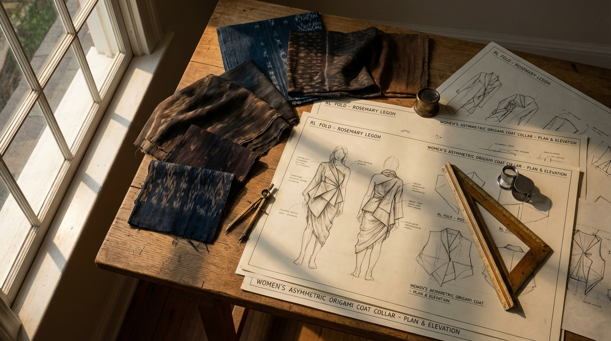
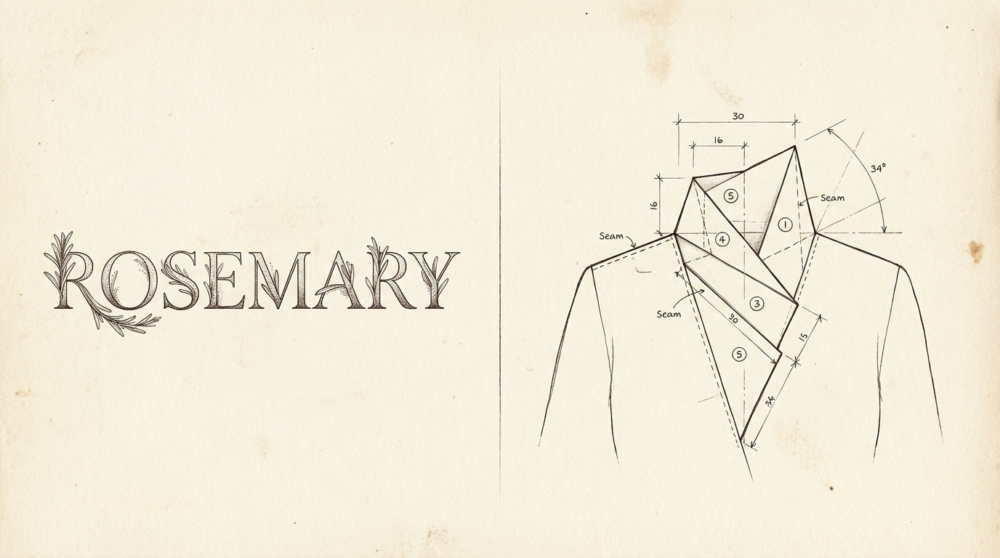
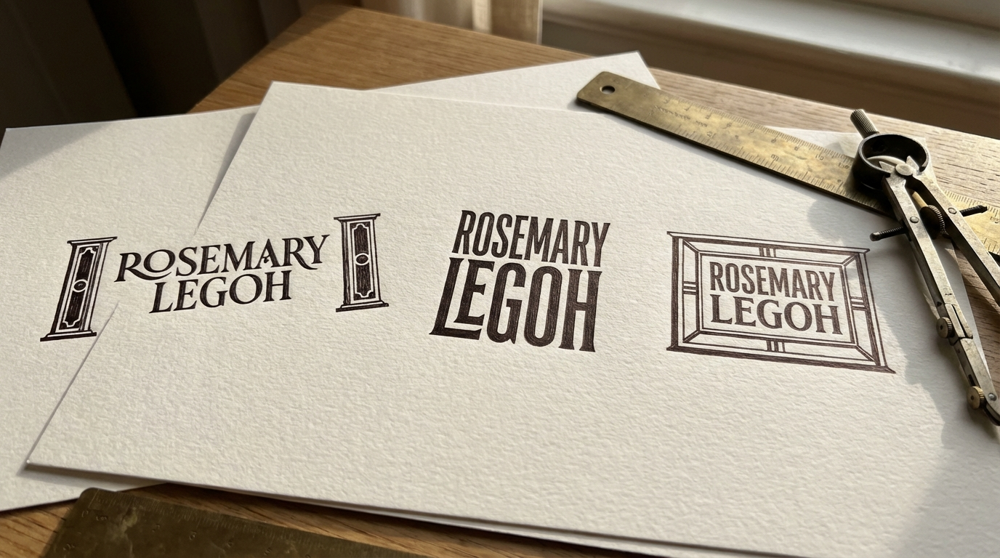
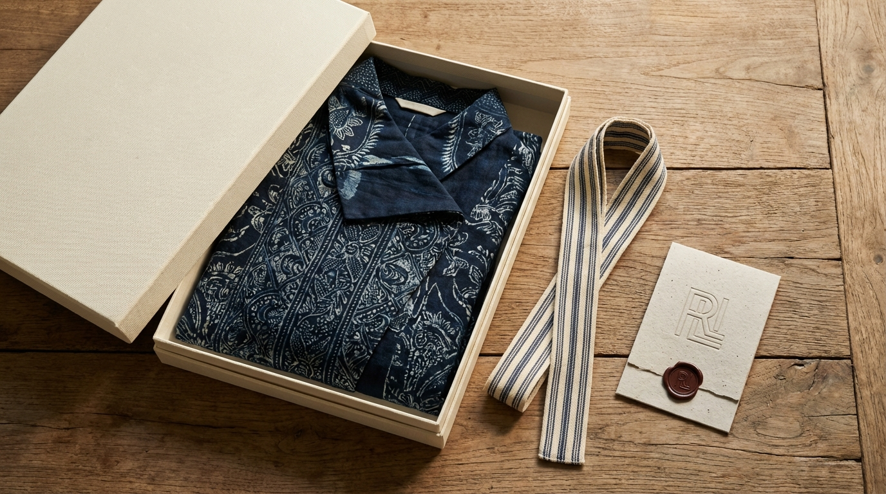
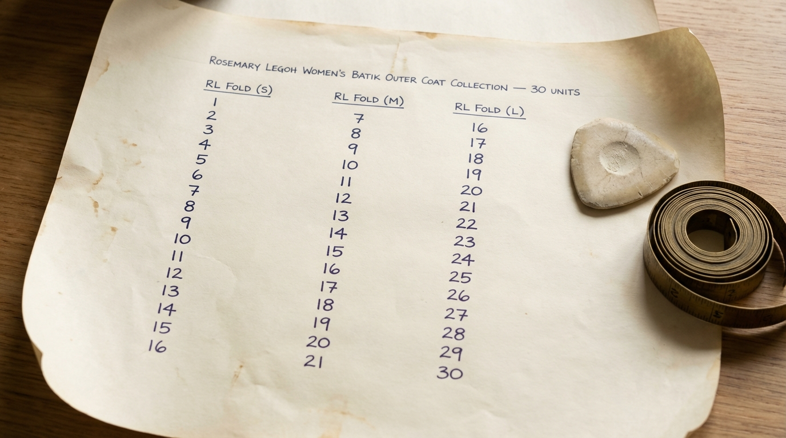
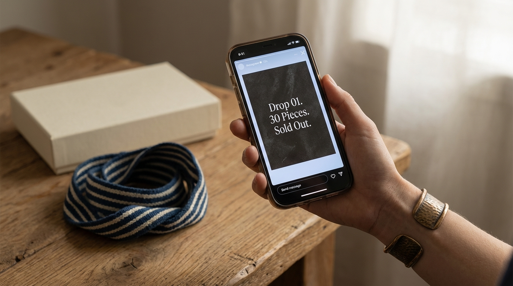

<br>

# ✦ BUILDING A FASHION HOUSE ✦


### *The Definitive Strategic Monograph*

<br>

> *"A house is not built from the roof down. It is built from the ground up — from the name carved into the threshold, through the mathematics of the fold, to the final handwritten note placed inside the box. This document is the blueprint."*

<br>

**Prepared for Judy Rosemary Legoh**
**Jakarta, March 2026**

<br>
<br>
<br>
<br>

---



---

<br>
<br>

## ✦ TABLE OF CONTENTS ✦

<br>

**PHASE I — THE SOVEREIGN IDENTITY** .............. *Naming, Persona & Community*
- 1.1 The Naming Module: Identity & Prestige
- 1.2 The Persona-Precision Filter
- 1.3 Niche Authority & Community Voice

**PHASE II — THE ARCHITECTURAL SIGNATURE** .............. *Logo, Fold & Art Direction*
- 2.1 The Architectural Emblem: Logo Suite
- 2.2 The Anatomy of the RL Fold
- 2.3 The Signature Look Visualizer
- 2.4 The Visual Storytelling Call Sheet

**PHASE III — MATERIAL INTELLIGENCE** .............. *Fabric, Standards & the Loom Grid*
- 3.1 Fabric Sourcing & Sustainability Standards
- 3.2 Operational Quality Guardrails

**PHASE IV — THE ECONOMICS OF SCARCITY** .............. *Pricing, Inventory & Ritual*
- 4.1 Scarcity-Based Unit Economics
- 4.2 Inventory & Drop Logic
- 4.3 The Unboxing as Ritual
- 4.4 The Waitlist Marketing Strategy

**PHASE V — THE PERMANENT HOUSE** .............. *Retention, Digital Strategy & Defense*
- 5.1 The Inner Circle Influencer Pitch
- 5.2 The High-Touch Retention Loop
- 5.3 The Omnichannel Digital Blueprint
- 5.4 Competitor Benchmarking & White Space Analysis
- 5.5 The Strategic Stress Test

**APPENDIX — IMAGE GENERATION SHEET** .............. *16 Prompts for Midjourney / DALL-E*

---

<br>
<br>
<br>

---

# PHASE I

# THE SOVEREIGN IDENTITY

### *Naming, Persona & Community*

<br>

> *Before a single thread is cut, before a fold is pressed into cloth, a house must know its own name. Phase I establishes the three pillars upon which all subsequent architecture rests: what the brand is called, who it speaks to, and how it speaks.*

<br>


---

<br>

## 1.1 THE NAMING MODULE: IDENTITY & PRESTIGE

<br>

### The Inquiry

***"Act as a High-End Brand Naming Consultant for the SE Asian 'Quiet Luxury' market. Rename 'JR Collection' (Owner: Judy Rosemary Legoh) to evoke structural innovation and heritage. Avoid 'JR' (childhood association) and 'Collection' (generic). Explore the surname 'Legoh' — its rhythmic and architectural phonetic quality. Provide 10 options across 'Atelier,' 'Abstract Heritage,' and 'Modern Matriarch' routes. Include a Brand Rationale and Visual Tagline for each."***

<br>

### The Blueprint

---

### The Phonetic Architecture of "Legoh"

Before any naming options are considered, a forensic analysis of the surname reveals why **"Legoh"** is a genuinely powerful brand asset.

| Phonetic Quality | Analysis | Brand Implication |
|---|---|---|
| **"Le-"** prefix | Echoes French luxury codes (*Le Labo, Le Bon Marché*) without being derivative | Instant *elevated* perception |
| **"-goh"** ending | Hard, clean stop — like an architectural corner. Decisive. Final. | Communicates **structure & confidence** |
| **Syllable count** | 2 syllables (Le · Goh) | Optimal for luxury branding — short enough to own, long enough to feel intentional |
| **Rhythmic quality** | Stress falls on the *second* syllable (le-**GOH**) | Creates natural *authority* — the stress lands, it *closes* like a signature |
| **Cultural ambiguity** | Sounds neither exclusively Western nor exclusively local | Perfect for SE Asian Quiet Luxury — *glocal* by nature |

> **Strategic Conclusion:** "Legoh" alone can carry a luxury brand. It needs the right *frame* — not a descriptor, but a *context word* that elevates it.

---

### Three Naming Routes, Ten Options

**Route I — Atelier** *("The Hand That Makes")*

| # | Name | Visual Tagline |
|---|---|---|
| 01 | **Legoh Atelier** | *"Structure is the most intimate form of beauty."* |
| 02 | **Maison Legoh** | *"A house is built once. A style is built forever."* |
| 03 | **Legoh Studio** | *"Every fold begins as a question."* |

**Route II — Abstract Heritage** *("Roots Made Invisible, Power Made Felt")*

| # | Name | Visual Tagline |
|---|---|---|
| 04 | **Rengga** | *"The space between structure and beauty — that is where we live."* |
| 05 | **Legoh Wira** | *"Dressed with the courage of those who came before."* |
| 06 | **Sulam** | *"Threaded with memory. Worn into the future."* |
| 07 | **Legoh Karsa** | *"Will is the first thread. Everything else follows."* |

**Route III — Modern Matriarch** *("Her Name. Her Rules. Her Legacy.")*

| # | Name | Visual Tagline |
|---|---|---|
| 08 | **Rosemary Legoh** | *"She remembered where she came from. Then she made something new."* |
| 09 | **Judy Legoh** | *"Not a trend. A signature."* |
| 10 | **The Legoh** | *"There are many names. There is only one Legoh."* |

---

### The Strategic Recommendation

| Priority | Name | Rationale |
|---|---|---|
| **Primary** | **Rosemary Legoh** | Timeless, earnable, tells a human story, ages into a legacy brand. The "Rosemary + Legoh" phonetic arc is genuinely beautiful. |
| **Immediate Market** | **Legoh Atelier** | Lowest barrier to consumer understanding, signals elevation immediately, practical for e-commerce and retail signage. |
| **Long-Term Vision** | **The Legoh** | If the brand commits to 3–5 years of building quality and consistency, this becomes the most *powerful* name in the room. |

> *A name is not a logo. It is the first decision your brand makes — and the one that echoes in every room your customer enters wearing your work.*

---

<br>



---

<br>

## 1.2 THE PERSONA-PRECISION FILTER

<br>

### The Inquiry

***"Act as a Consumer Psychologist specializing in the Indonesian 'Affluent Urban' market. Take three core personas (The Cultural Architect, The Boardroom Modernist, and The Social Curator) and define their 'Value Triggers.' Identify 3 'Style Insecurities' they have with traditional Wastra. Identify aesthetic 'cues' that signal 'High-End' vs 'Mass-Market.' Create a 'Day-in-the-Life' content map for how Rosemary Legoh fits into their daily rituals."***

<br>

### The Blueprint

---

### Persona I: The Cultural Architect

**Profile:** Age 34–48. Senior academic, museum curator, cultural NGO director. Lives in Menteng, Kemang, or Bandung's Dago area. Her wardrobe is a curated thesis, not a trend report.

**Style Insecurities with Traditional Wastra:**

| Insecurity | Underlying Fear |
|---|---|
| **"Too Ceremonial"** — fears performing heritage rather than *living* it | Inauthenticity in her own identity |
| **"Intellectually Passive Silhouette"** — standard batik outers feel structurally "quiet" | Clothing undermines professional gravitas in Western-dominated spaces |
| **"Mass-Reproduced Motif"** — acutely aware that her motif may be sold in 500 units at Tanah Abang | Being exposed as non-discerning by the community she leads |

**High-End Signals She Reads Instantly:**
- A structural element that references art history — an asymmetric fold, a deconstructed collar — that she can *narrate* to peers
- Fabric with visible hand-weave variation, proving it was not mass-loomed
- Minimal or no visible branding — the label is a secret; the design is the signature
- A verifiable provenance story — she will ask "Which atelier? Which weaver family?"

---

### Persona II: The Boardroom Modernist

**Profile:** Age 28–42. C-suite executive, startup founder, or senior consultant. Based in SCBD or Sudirman. Her reference points are global: she compares Jakarta to Singapore and Seoul.

**Style Insecurities with Traditional Wastra:**

| Insecurity | Underlying Fear |
|---|---|
| **"Reads as Traditional, Not Strategic"** — a batik blazer can signal "local vendor" rather than "global peer" | Being perceived as less cosmopolitan than counterparts |
| **"The Kondangan Confusion"** — traditional silhouettes are associated with ceremonies, not commerce | Styling choice undermines professional context |
| **"Fit Without Architecture"** — most Wastra outers are cut for softness, not for power dressing | Looking shapeless in high-stakes visual environments |

**Her Day with Rosemary Legoh:**
- **08:30** — Board meeting. The RL Fold collar is structural armour. The asymmetry communicates creative intelligence within a formal frame.
- **13:00** — Lunch with a PE partner. Her Wastra choice prompts the question *"Where is that from?"* — a competitive intelligence advantage.
- **21:00** — Winds down, checks Instagram. She is looking for *the next drop announcement* so she can be first.

---

### Persona III: The Social Curator

**Profile:** Age 24–38. Creative director, lifestyle content creator, brand consultant. Based in Menteng, Cipete, or Bali. Her identity is her aesthetic — and her aesthetic is her professional currency.

**Style Insecurities with Traditional Wastra:**

| Insecurity | Underlying Fear |
|---|---|
| **"Overdone by the Algorithm"** — every Wastra look has been done by 50 influencers this month | Aesthetic ordinariness in an environment where her value is aesthetic exceptionalism |
| **"Narrative Poverty"** — a non-exclusive piece has no story that isn't already told | Content that underperforms because it lacks a unique anchor |
| **"The Costume Effect"** — hyper-aware of the line between styling heritage and costuming ethnicity | Being called out by a culturally literate audience |

**What Rosemary Legoh Gives Her:**
- An element that photographs *differently* from every angle — the RL Fold's asymmetry creates a new visual story in every frame
- A brand with *friction in the purchase process* — a waitlist, a DM-first system, the absence of a public "Add to Cart" button. Scarcity is content in itself.
- The garment's design can be the subject of a 90-second Reel without relying on the wearer's face

---

### Cross-Persona Value Trigger Matrix

| Value Trigger | Cultural Architect | Boardroom Modernist | Social Curator |
|---|---|---|---|
| **Provenance** | Critical — she researches it | Moderate — she uses it as context | High — it is her caption |
| **The RL Fold** | Intellectual artifact | Power silhouette | Photographic subject |
| **Scarcity (30 units)** | Validates exclusivity | Reduces risk of over-exposure | Creates urgency and FOMO content |
| **Heritage Story** | Core motivation | Conversation asset | Narrative infrastructure |

---

<br>

## 1.3 NICHE AUTHORITY & COMMUNITY VOICE

<br>

### The Inquiry

***"Act as a Community Manager for a boutique heritage brand. Define a 'Community Voice' for Rosemary Legoh that speaks to urban Indonesian women who value 'Modern Wastra.' Provide examples of behind-the-scenes artisan storytelling, how to lead styling discussions, and how to make customers feel like 'Patrons' in an exclusive inner circle."***

<br>

### The Blueprint

---

### The Voice Pillars

| Pillar | What It Is | What It Is Not |
|---|---|---|
| **Informed Intimacy** | Speaking like a knowledgeable friend who happens to know a master weaver | Lecturing. Condescending. |
| **Quiet Confidence** | Asserting the value of The RL Fold without ever defending it | Boasting. Over-explaining. |
| **Cultural Reverence** | Honoring the *ibu-ibu* artisans and their craft as the true authority | Tokenizing. Performative. |
| **Selective Inclusion** | Making the community feel chosen, not marketed to | FOMO manipulation. Spam. |

### The Owned Vocabulary

| Owned Word | Meaning in Context |
|---|---|
| **The Fold** | The RL Fold structural signature — the brand's core innovation |
| **Patron** | What we call our customers — never "buyer," "follower," or "customer" |
| **The Inner Circle** | The waitlist / VIP community |
| **Wastra** | Indonesian textiles — always used with reverence |
| **The House** | Rosemary Legoh as an institution |
| **A Drop** | A new collection release |
| **Architectural** | The design philosophy — structure-first, motif-second |

---

### Artisan Storytelling: Four Formats

**Format 1 — "The Maker's Hand"** *(Instagram Stories / Reels)*
Close-up video of artisan hands working. Natural light. No filters. The personal sign-off from "Rosemary" (not the brand account) collapses distance between founder and community.

> *"Ibu [Name] has been folding fabric for [X] years in [City]. The [motif] you see being formed here will become The Fold on [Drop Name]. There will be [number] of these in the world. — Rosemary"*

**Format 2 — "The Material Diary"** *(Instagram Feed Carousel)*
A 5-slide walk from raw material to finished piece. Slide 4 is the critical moment: *"This is the moment. This is why it cannot be copied."*

**Format 3 — "The Origin Visit"** *(Reels or YouTube Shorts)*
Observational, not promotional. No scripted lines. Authentic reactions from the workshop visit.

**Format 4 — "The Imperfection Note"** *(Stories or WhatsApp Broadcast)*
When a batch is delayed or production yields fewer pieces than planned, tell the community before they ask: *"We would rather release less than release wrong. — Rosemary"*

---

### The Patron Privilege Ladder

| Tier | Definition | What They Receive |
|---|---|---|
| **The Waitlist** | Registered interest, not yet purchased | Purchase link 24 hours before public |
| **First Patron** | Completed one purchase | Personal thank-you note from Rosemary |
| **Returning Patron** | Two or more purchases | Early preview of next collection. Direct WhatsApp access. |
| **House Patron** | Collector of 3+ pieces | Invited to private fittings. First right of refusal on made-to-order pieces. Named in brand archive. |

---

<br>
<br>
<br>

---

# PHASE II

# THE ARCHITECTURAL SIGNATURE

### *Logo, Fold & Art Direction*

<br>

> *Phase II is the visual cornerstone of the House. Here, the abstract authority established in Phase I is given form — in a logotype, in a structural collar, and in a visual language that teaches the world how to see the brand.*

<br>



---

<br>

## 2.1 THE ARCHITECTURAL EMBLEM: LOGO SUITE

<br>

### The Inquiry

***"Act as a Creative Director. Design a logo suite for Rosemary Legoh. The aesthetic must balance Modernist Architecture with abstract Indonesian Wastra references. Deliver: 1) A Primary Logotype with 'structured' custom typography. 2) An Abstract Monogram (The Mark) for hardware and tags. 3) A minimalist 'Tanah & Laut' color palette. Provide 3 concepts with design rationales explaining the 'Architectural Signature' of each."***

<br>

### The Blueprint

---

### Pre-Design Manifesto

Two visual languages must hold each other in productive tension throughout this identity system:

| Modernist Architecture | Indonesian Wastra |
|---|---|
| Load-bearing geometry — the column, beam, threshold | Sacred geometry — kawung circles, parang diagonals, tumpal triangles |
| Swiss precision, negative space as structural logic | Hand-drawn rhythm, the human irregularity in a woven edge |
| The **grid** as an act of control | The **loom** as an act of devotion |
| **Silence between elements** | **Story within every thread** |

The mandate: find the single line where a Mies van der Rohe floor plan and a Javanese *kain panjang* occupy the same visual breath.

---

### Concept 01 — "The Threshold"
**Architectural Signature: The Portal**

The logotype is flanked by two vertical "portal pillars" — referencing the precise moment of transition from outside to inside in Modernist architecture, and the *seret* (vertical boundary line) in Javanese *batik pagi-sore*. The name becomes a doorway.

**The Mark:** Two vertical strokes joined at the base with a single descending stroke — reading simultaneously as the letter π, a loom heddle, and a threshold in plan view.

**Palette — Threshold Edition:**
- **Tanah Kapur** (#F5F0E8) — Limestone. Warm white with mineral depth.
- **Arang Kayu** (#1C1A17) — Charcoal Wood. Near-black, warm undertone.
- **Laut Dalam** (#1E3040) — Deep Sea. Near-navy, cold and still.
- **Perunggu** (#A0845C) — Bronze Patina. Accent. Max 8% of any composition.

---

### Concept 02 — "The Loom Column"
**Architectural Signature: The Colonnade**

The two names are set vertically — ROSEMARY and LEGOH as parallel columns. The composition mirrors *tenun ikat* weaving, where warp threads run in taut vertical columns. The misaligned starting points represent columns carrying different loads.

**The Mark:** Two vertical strokes of unequal height on a shared horizontal base — a colonnade at its most structurally honest.

**Palette — Colonnade Edition:**
- **Tanah Merah** (#3D2B1F) — Red Earth. Deep terracotta-brown.
- **Gading** (#F2ECE0) — Aged Ivory. Warmer than white, cooler than cream.
- **Laut Hijau** (#2D4A3E) — Mangrove Sea. Green-black, coastal depth.
- **Emas Antik** (#C9A96E) — Antique Gold. Warm, matte. Hardware accent.

---

### Concept 03 — "The Parang Grid"
**Architectural Signature: The Structural Bay**

"ROSEMARY" is enclosed in a precise rectangular box — the structural bay. "LEGOH," set wider below, deliberately overflows the box above — the *parang rusak* move: the intentional break in the grid that carries the most meaning.

**The Mark:** An open rectangle that deliberately leaks at two calculated points. In Indonesian textile tradition, certain sacred cloths are intentionally left with an unfinished edge — the *tumpal* is withheld. The brand that knows when *not* to finish is the brand that has mastered its craft.

**Palette — Parang Grid Edition:**
- **Tanah Putih** (#E8E2D9) — White Clay. Mineral silence.
- **Hitam Tinta** (#18140F) — Ink Black. Warm, contains brown, not blue.
- **Benang Merah** accent for chaptered headers.

<br>


---

<br>


---

<br>

## 2.2 THE ANATOMY OF THE RL FOLD

<br>

### The Inquiry

***"Act as a Fashion Historian and Structural Designer. Define the 'Anatomy of the RL Fold.' Explain how this specific asymmetric origami collar bridges Indonesian 'wiron' pleating with modernist architecture. Provide a 'Design Manifesto' that explains why this structure is a superior innovation to standard flat-pattern batik."***

<br>

### The Blueprint

---

### Origins: A Lineage of Two Intelligences

**The Indonesian Root: Wiron as Sacred Geometry**

*Wiron* is the precise, repetitive accordion-pleating applied to the front hem of the Javanese *kain*. Each pleat is equidistant, directional (always folded toward the left), and flat. The wiron is a technology of controlled repetition. It is reverence made visible. In the royal Javanese aesthetic, the wiron pleat is not decorative — it is *cosmological*.

**The Western Root: Modernist Origami Structuralism**

In 1959, Jørn Utzon won the Sydney Opera House commission with the revelation that a flat plane, when scored and rotated along a diagonal axis, creates three-dimensional form with extraordinary structural rigidity. This principle courses through Tadao Ando's concrete articulations, Zaha Hadid's parametric folds, and Issey Miyake's *Pleats Please*. The asymmetric fold is the most sophisticated gesture: it creates **directional tension** — the eye follows the fold line like a horizon.

---

### The Five Structural Zones

> *A single, non-mirrored fold originating at the left clavicle, traveling diagonally across the neckline, and resolving at a point below the right shoulder blade — creating a continuous, sculptural plane that functions simultaneously as collar, lapel, and architectural facade.*

| Zone | Name | Structural Role | Architectural Reference |
|---|---|---|---|
| **1** | The Origin | Anchor at left clavicle | Ground plane / Foundation |
| **2** | The Diagonal | Primary fold at 34° | Utzon's shell rotation axis |
| **3** | The Peak (Apex) | Highest visual point at center-neckline | The load-bearing arch |
| **4** | The Descent | Rearward travel toward right shoulder | Hadid's parametric plane |
| **5** | The Resolution | Hidden sub-scapular anchor | The cantilever — held by invisible tension |

### The 34-Degree Rule

The fold's diagonal travels at precisely **34 degrees** from horizontal. At less than 30°, it reads as a soft cowl. At more than 40°, a draped sash. At 34°, the fold sits in the **tectonic sweet spot**: the angle at which a folded plane appears both suspended and permanent. This is the same angular logic as the pitched roof structures of Minangkabau *Rumah Gadang* architecture.

<br>


---

### The Design Manifesto

**The Problem with Flat-Pattern Batik:**
1. The garment hangs from the body — there is no dialogue between structure and form.
2. The batik motif is treated as wallpaper — applied to a pre-existing silhouette.
3. All flat-pattern batik garments read the same at distance.
4. There is no proprietary geometry. Any tailor can reproduce it.
5. The garment ages as a commodity.

> The flat-pattern batik outer is a **beautiful surface without a spine.**

**What the RL Fold Provides:**

- **Proprietary structural signature.** The 34-degree asymmetric scored fold cannot be sketch-and-copied without understanding the internal scoring system, the fabric tension requirements, and the five-zone resolution logic.
- **A living dialogue between textile and structure.** When a macro-scale batik motif is cut along the fold line, it is interrupted and transformed. The batik becomes *architectural material*, not decorative surface.
- **Changed spatial reading.** The eye travels diagonally upward along the fold line. The body in the RL Fold is a building that controls sight lines.
- **Solved the "Batik Problem."** The textile remains batik — the cultural credential is intact. The structure asserts architectural modernity. She does not have to choose between her culture and her ambition.
- **Durable design system.** Architectural signatures do not expire. The Eames chair is not a trend. The Barcelona Pavilion is not a trend. The RL Fold does not compete with seasons. **It predates them and outlasts them.**

> *We come from a civilization of weavers. We think like architects. We dress like neither — and both.*

---

<br>


---

<br>

## 2.3 THE SIGNATURE LOOK VISUALIZER

<br>

### The Inquiry

***"Generate a high-fashion editorial photo prompt for Midjourney/DALL-E of a model in an RL Fold outer. The setting must be an 'insider' location (Jakarta art gallery). Lighting should be natural/unfiltered to maintain 'Quiet Luxury' appeal. Reference Vogue Indonesia aesthetics."***

<br>

### The Blueprint

---

### Prompt Architecture: Four Pillars

| Pillar | What It Controls |
|---|---|
| **Subject** | Model type, pose energy, attitude |
| **Garment** | RL Fold silhouette description for AI accuracy |
| **Location** | Jakarta insider setting, background depth |
| **Lighting & Mood** | Natural/unfiltered — Quiet Luxury authenticity |

### Hero Campaign Prompt

> *Editorial fashion photograph of an Indonesian woman in her late 30s, composed and architectural in energy, wearing a structured asymmetric origami-collar outer coat in hand-dyed Javanese batik silk — deep indigo and warm ivory — the collar folds away from the neck in a single dramatic angular pleat (the RL Fold), casting a soft geometric shadow across the collarbone. She stands in a minimalist Jakarta contemporary art gallery — raw concrete walls, floor-to-ceiling glass overlooking tropical foliage. Natural afternoon sidelight, unfiltered. She holds a minimal leather clutch, no jewelry except one architectural cuff. Expression: still, knowing, undeniably present. Vogue Indonesia aesthetic. Medium-format film. Warm neutrals, desaturated shadows.*

### Supporting Prompt Series

**A — Gallery Interior Series:**
- The Contemplative Stand (golden hour, off-white RL Fold, Peter Lindbergh influence)
- The Artwork Dialogue (side angle, garment motif echoing abstract painting)
- The Exit Frame (mid-stride, fold lifting with movement, backlit rim light)

**B — Detail & Close-Up Series:**
- The Fold Architecture (45° angle macro of collar construction)
- Hands & Fabric (hands closing the concealed button, collar cascading)

**C — Environmental Storytelling:**
- The Courtyard Moment (moss-covered stone, dappled tropical light)
- The Curator's Table (café, books, ceramic cup, candid energy)

### Lighting Language

| Setting | Source | Mood |
|---|---|---|
| Gallery Interior | Late afternoon through glass | Warm, directional, long soft shadows |
| Courtyard | Filtered canopy sunlight | Dappled, organic, high contrast texture |
| Detail Shot | Single soft source simulating window | Intimate, texture-forward |

**Key Rule:** No hard flash. The RL Fold must be revealed by light, not constructed by it.

---

<br>

## 2.4 THE VISUAL STORYTELLING CALL SHEET

<br>

### The Inquiry

***"Act as a Fashion Art Director. Create a 'Photoshoot Call Sheet' for a real photographer. Define the 'Model Archetype' and 'Lighting Language' (high-contrast shadows to emphasize the fold's geometry). Provide 5 'Power Poses' that highlight the structural asymmetry for Instagram use."***

<br>

### The Blueprint

---

### Campaign: "The Architecture of Silence"

### The Model Archetype: "The Urban Matriarch"

- **Age range:** 32–45 years
- **Build:** Lean-to-medium. Shoulders square and defined — critical for fold geometry to read in frame.
- **Psychological profile:** She does not perform for the camera. She **occupies space.** Her expression communicates a woman who owns rooms before she speaks.
- **Hair & Makeup:** Sleek, structured, away from the collar. "Skin-first" — defined brow, a single tonal lip. No shimmer. The shadow work is the lighting director's job.

### Primary Lighting Directive: "Shadow as Structure"

The RL Fold was designed with shadow in mind. The asymmetric planes create natural ledges that catch directional light. The lighting mandate: **sculpt with shadow**, not illuminate uniformly.

| Setup | Type | Intent |
|---|---|---|
| **"The Fold Reveal"** | Single hard source at 45° left, 60° elevated. Zero fill. | The fold's ridge catches key light, casting a deep geometric shadow across the chest. The shadow *draws the fold*. |
| **"The Silhouette Study"** | Backlit diffused source behind talent. Rim light at 90°. | Full body silhouette — the fold's structural shape reads as pure line, like an architectural elevation. |
| **"Close Geometry"** | Macro, hard raking light at 90°. No fill. | Every stitch, every pleat ridge reads as intentional engineering. |

### The 5 Power Poses

| # | Pose Name | Direction | Instagram Format |
|---|---|---|---|
| 1 | **The Load-Bearing Wall** | Stand in profile, weight shifted back, gaze out of frame. The outer cantilevered off a vertical body line. | 4:5 Portrait — **HERO** |
| 2 | **The Cantilever** | Walk at 30° toward camera, composed mid-stride. Leading arm swings forward, exposing fold's underside geometry. | 4:5 Portrait |
| 3 | **The Overhang** | Seated on a hard-edge surface. Back straight. Direct gaze to camera. Only pose with eye contact. | 1:1 Square |
| 4 | **The Negative Space** | Back to camera. Arms relaxed. Absolute stillness. Back panel's structural seam is the full subject. | 4:5 + 9:16 Story |
| 5 | **The Reveal Hand** | Head turned to expose fold collar. One hand at collarbone, fingertips framing the asymmetry without touching it. | 1:1 Carousel |

<br>


---

<br>
<br>
<br>

---

# PHASE III

# MATERIAL INTELLIGENCE

### *Fabric, Standards & the Loom Grid*

<br>

> *A design house is only as permanent as the materials it commands. Phase III establishes the fabric standards, sourcing partnerships, and quality control protocols that ensure the RL Fold is never compromised by an inferior cloth.*

<br>


---

<br>

## 3.1 FABRIC SOURCING & SUSTAINABILITY STANDARDS

<br>

### The Inquiry

***"Act as a Textile Sourcing Specialist in Indonesia. Develop a 'Fabric Standards Manual' for our signature outers. How do we partner with weavers in Solo or Pekalongan to create 'Exclusive Motifs'? Create a checklist for testing 'Drape and Rigidity' to ensure the Wastra can hold the structural RL Fold through multiple wearings."***

<br>

### The Blueprint

---

> *"The RL Fold does not forgive an inferior cloth. The fabric is not the canvas — it is the co-architect."*

### The Structural Demand

The RL Fold imposes three simultaneous demands on any fabric:
1. **Crease Memory** — The cloth must hold a fold line and return to it after movement.
2. **Tensile Resilience** — The bias fold axis places anisotropic stress on the weave; yarns must not separate.
3. **Drape Directionality** — The asymmetric cascade must fall in a single, intentional plane.

### Primary Sourcing Hubs

**Solo (Surakarta) — The Court of Structured Motifs**
Sogan palette, royal court motifs (*parang*, *kawung*, *truntum*). Cotton primissima with excellent crease memory — the **primary substrate candidate** for the RL Fold collar. Partners: workshops in the *Laweyan* or *Kauman* batik districts with a minimum 2-generation master weaver lineage.

**Pekalongan — The Laboratory of Textile Innovation**
Looser, more expressive motifs. Brighter palettes. Higher innovation culture. Candidates for the **cascade drape** — the outer shell panel where movement is desired. Partners: workshops on the *Jl. Blimbing* corridor.

**ATBM Woven Textiles** — *Tenun Troso* (Jepara) and *Tenun Lurik* (Klaten) for interlining-free collar construction where maximum rigidity is required.

### The Exclusive Motif Partnership Protocol

1. **Heritage Consultation** (*Musyawarah Motif*) — 2-session consultation with the master pengrajin.
2. **Exclusivity Agreement** — Motif locked for 24 months. Prohibition on sale to competing labels.
3. **Structural Testing** — 5-meter sample run must pass Drape & Rigidity Checklist.
4. **Living Rate Agreement** — Minimum 120% above local market rate. 40/60 payment terms.
5. **Attribution & Documentation** — Artisan credited on garment labels.

<br>


<br>

### The RL Fold Drape & Rigidity Checklist (Summary)

**Base Fabric Qualification:**
- Thread count: Min. 40 threads/cm (cotton), 35/cm (silk blends)
- Shrinkage: Max 3% in any direction
- Bias stretch: Max 4mm elongation per 30cm
- Dye fastness: Min. Grade 4 (dry), Grade 3 (wet)

**Fold Integrity Tests** (on a sewn test collar):
- Crease memory must retain ≥85% of pressed shape after 2-hour hang
- Structural collapse test: 200g lateral pressure, must self-recover
- Cascade drape: must fall in a single plane with no lateral ballooning

**Approved Fabric Matrix:**

| Fabric Type | Source | RL Fold Application |
|---|---|---|
| Cotton Primissima (batik) | Solo | Primary fold collar structure |
| Mori Batik (fine cotton) | Pekalongan | Cascade outer panel |
| Tenun Troso | Jepara | Statement collar on non-batik line |
| ATBM Woven Silk | Pekalongan / Palembang | Evening/formal outer |
| Tenun Lurik | Klaten | Structural lining for collar |

> **Prohibited:** Polyester blends above 20%, knit constructions, non-woven bonded textiles.

### The Fabric Pledge

1. Zero anonymous sourcing. Every fabric carries a documented origin.
2. Fair rate minimums. The 65% margin target is achieved through price architecture — not artisan cost-cutting.
3. Motif sovereignty. No sacred *motif larangan* used without cultural authority consultation.
4. Archive commitment. One fabric sample contributed to the artisan's own archive per motif.
5. Production lot limits. Maximum 30 units per exclusive motif run per season.

---

<br>

## 3.2 OPERATIONAL QUALITY GUARDRAILS

<br>

### The Inquiry

***"Act as an Operations Manager for a luxury garment house. Create a 15-point Quality Control checklist specifically for The RL Fold construction. Include fabric shrinkage tests, pattern grading for oversized fits, and finish-work standards for high-end boutique retail. Define the production timeline for a 30-unit batch."***

<br>

### The Blueprint

---

### The 15-Point QC Master Checklist

**Gate 1 — Pre-Cut (Fabric Integrity)**

| # | Checkpoint | Pass Standard |
|---|---|---|
| 1 | Pre-Wash Shrinkage Test | ≤3% shrinkage, warp and weft |
| 2 | Drape & Rigidity Assessment | Edge crease holds ≥10 seconds under own weight |
| 3 | Colorfastness & Lot Consistency | No visible dye transfer; no color deviation from reference swatch |
| 4 | Pattern Template Verification | Zero deviation across all 12 fold reference points vs. Master Block |
| 5 | Pattern Grading for Oversized Fit | Fold apex angle fixed at 42°±2° across all sizes |

**Gate 2 — In-Construction (The Fold Execution)**

| # | Checkpoint | Pass Standard |
|---|---|---|
| 6 | Interfacing Placement | Edges ≥5mm inside seam allowances; no crossing of fold crease line |
| 7 | Fold Construction Sequence | 5-step protocol: baste → press → inspect → sew → final press. No deviation. |
| 8 | Stitch Quality & Tension | 2.2mm structural; 1.8mm topstitch. No puckering, no gaping. |
| 9 | Asymmetry Verification | Right collar extends 3.5cm ± 0.3cm further than left. **Most critical measurement.** |
| 10 | On-Form Shoulder & Armscye Check | Fold sits flat against clavicle, apex forward, body perpendicular to floor. |

**Gate 3 — Final Inspection (Finish-Work & Presentation)**

| # | Checkpoint | Pass Standard |
|---|---|---|
| 11 | Edge Finishing | Hong Kong bound seams. No raw edges. Silk tape lies flat. |
| 12 | Closure Integrity | 10 open/close cycles. No thread pull, no loosening. |
| 13 | Hem Consistency | ±3mm around full circumference. Blind-stitched or hand-fell. |
| 14 | Label Placement | Centre-back neck seam. Never inside the fold. |
| 15 | Final Presentation | Steamed, photographed beside Master Reference. APPROVED or QUARANTINE. |

> Any unit that fails a checkpoint is **quarantined** — not discounted, not sold as a second.

---

### Production Timeline: 30-Unit Batch

| Phase | Days | Activity |
|---|---|---|
| Pre-Production | 1–2 | Fabric receiving, shrinkage tests, lot documentation |
| Pattern Prep | 3 | Template verification, grading approval |
| Cutting | 4–5 | All 30 units cut and bundled |
| Basting & Interfacing | 6–7 | Interfacing fused, fold basted and pressed |
| Batch Fold Inspection | 8 | All 30 basted folds inspected before permanent sewing |
| Fold Construction | 9–11 | Permanent seaming and topstitching (max 10 units/tailor/day) |
| Asymmetry Check | 12 | Measurement logged for all 30 units |
| Assembly | 13–15 | Shoulder, side seams, armscye set, on-form inspection |
| Finishing | 16–18 | Bound seams, closures, hem work |
| Labels & Assets | 19 | Brand label and hang-tag attachment |
| Final QC | 20–21 | Steam, photograph, Master Reference comparison |
| Buffer & Corrections | 22–23 | Rework quarantined units |
| Packaging | 24–25 | Box, tissue, heritage card insertion |
| **Dispatch Ready** | **26** | Batch closed. Approved for release to waitlist. |

**Total Lead Time: 26 Working Days** (from fabric receipt to dispatch-ready)

---

<br>
<br>
<br>

---

# PHASE IV

# THE ECONOMICS OF SCARCITY

### *Pricing, Inventory & Ritual*

<br>

> *Scarcity is not what happens when a brand runs out. It is what a brand engineers before it begins. Phase IV establishes the financial architecture, the unit allocation logic, the packaging ritual, and the waitlist psychology that transform 30 garments into 30 acts of desire.*

<br>



---

<br>

## 4.1 SCARCITY-BASED UNIT ECONOMICS

<br>

### The Inquiry

***"Act as a Boutique Business Consultant. Help me calculate a 'Premium Niche Price' for a limited run of 30 units. COGS is [C]. I need a 65% gross margin to fund high-touch service and premium packaging. How do I communicate this 'Small Batch' value to justify a designer price point?"***

<br>

### The Blueprint

---

### The 65% Gross Margin Formula

$$\text{Selling Price} = \frac{\text{COGS}}{1 - 0.65} = \text{COGS} \times 2.857$$

| COGS (IDR) | Min. Price (65% GM) | Prestige Price |
|---|---|---|
| Rp 800,000 | Rp 2,285,714 | **Rp 2,400,000** |
| Rp 1,200,000 | Rp 3,428,571 | **Rp 3,500,000** |
| Rp 1,500,000 | Rp 4,285,714 | **Rp 4,400,000** |
| Rp 2,000,000 | Rp 5,714,286 | **Rp 5,800,000** |

> **Prestige Price Rounding:** Never round to the nearest clean number. A price of Rp 5,200,000 feels *considered*. Rp 5,000,000 feels *calculated*.

**Recommendation:** Target **68–72% gross margin**, not 65%. The extra margin absorbs customs delays, fabric rework, and funds a pop-up event for the next drop.

---

### 30-Unit Batch Economics (at Rp 1,500,000 COGS)

| Line Item | Per Unit | 30-Unit Batch |
|---|---|---|
| COGS (Fabric + Labour + QC) | Rp 1,500,000 | Rp 45,000,000 |
| Packaging | Rp 150,000 | Rp 4,500,000 |
| Photography (amortised) | Rp 50,000 | Rp 1,500,000 |
| Shipping & Handling | Rp 35,000 | Rp 1,050,000 |
| Payment Gateway (3%) | Rp 132,000 | Rp 3,960,000 |
| **Total Loaded Cost** | **Rp 1,867,000** | **Rp 56,010,000** |
| **Selling Price (70% GM)** | **Rp 5,000,000** | **Rp 150,000,000** |
| **Net Contribution** | **Rp 3,133,000** | **Rp 93,990,000** |

Even at 83% sell-through (25 of 30 units), the drop remains profitable. The remaining 5 units are never discounted: they are gifted to strategic relationships, held for trunk shows, or archived.

---

### Communicating Small-Batch Value: Three Pillars

**Pillar 1 — Finite Supply as Feature, Not Apology**
> *"Each drop is deliberately limited to 30 pieces — the maximum number the lead tailor can produce without compromising the RL Fold's structural integrity."*

**Pillar 2 — The COGS Story (Without Revealing the Number)**
> *"The fabric alone — handwoven ATBM batik from Pekalongan — takes three weeks to weave for a single bolt. The RL Fold collar requires 14 individual construction steps."*

**Pillar 3 — The Investment Framing**
> *"A Rosemary Legoh outer is not seasonal. The RL Fold is not a trend — it is a structural signature that has no reference in the current market. In three years, this piece will be more relevant, not less."*

### The Price Integrity Rules

1. **No public discounts. Ever.** Unsold units are archived, not marked down.
2. **Price increases between drops are expected.** Communicate proactively.
3. **The price is the same for everyone.** Inner Circle gets *access*, not price privileges.
4. **Instalment options are acceptable; discounts are not.**

---

<br>

## 4.2 INVENTORY & DROP LOGIC

<br>

### The Inquiry

***"Act as a Fashion Merchandiser. Create an 'Optimized Size & Volume Map' for a 30-unit small-batch drop in Indonesia. What is the ideal 'Size Curve'? How do we split units across 'Café,' 'Boardroom,' and 'Kondangan' looks to maximize 'Sold Out' psychological effects?"***

<br>

### The Blueprint

---

### The Indonesian Size Curve: 30 Units

| Size | Demographic % | Adjusted for RL Fold (Oversized Fit) | Units |
|---|---|---|---|
| **S** | 18% | 22% (size-down effect) | **7** |
| **M** | 34% | 40% (largest active demographic) | **12** |
| **L** | 30% | 26% (size-down reduces demand) | **8** |
| **XL** | 18% | 14% | **3** |

**Final Size Curve: 7 – 12 – 8 – 3**

### Three-Look Architecture: Staged Sell-Out

| Look | Units | Strategic Role | Size Split |
|---|---|---|---|
| **Kondangan** | 12 (40%) | First to sell out — creates urgency signal | S:2 M:5 L:4 XL:1 |
| **Boardroom** | 11 (37%) | Second wave — validates professional prestige | S:3 M:5 L:2 XL:1 |
| **Café** | 7 (23%) | Final clearance — closes the drop story | S:2 M:2 L:2 XL:1 |

### The 72-Hour Sell-Out Architecture

**Hour 0–24: Kondangan Wave** — Drop link sent via WhatsApp. Only Kondangan imagery shown. Target: complete sell-out by Hour 24.

**Hour 24–48: Boardroom Wave** — *"Kondangan is gone. Boardroom is now open."* Show the RL Fold collar detail in video — the Boardroom buyer's primary decision point.

**Hour 48–72: Café Wave** — Warmer, more editorial tone. *"Only the Café edition remains. 7 pieces. This is the final chapter of Drop 01."*

**The Closing Ritual:** When the final unit sells, post a single dark image with white text: *"Drop 01. 30 Pieces. 72 Hours. It's done."*

---

<br>



---

<br>

## 4.3 THE UNBOXING AS RITUAL

<br>

### The Inquiry

***"Act as a Luxury Packaging Designer. Create a 'Signature Unboxing Experience' for Rosemary Legoh. Suggest sustainable but premium materials. Design the 'Heritage Note' — a small card explaining the RL Fold story. How can we make the physical arrival a 'social media-worthy' moment?"***

<br>

### The Blueprint

---

> *"The garment enters the world twice: once when it is made, and once when it is received. The second birth must be as intentional as the first."*

### The Packaging Architecture

**The Outer Vessel — "The Gedung Box"**
Rigid two-piece lift-off box. 38cm × 38cm × 12cm. 3mm greyboard wrapped in **Kraft-linen laminate** — resembling architectural concrete. Single debossed wordmark on lid: **ROSEMARY LEGOH**. No foil, no color. Inner lining: natural undyed cotton muslin from the same Solo cooperatives that supply garment fabric.

**The Three-Stage Interior Reveal:**

*Stage 1 — The Sealing Band:* A 12cm band of handwoven **Lurik fabric** in Tanah (warm off-white) and Laut (deep ocean indigo), tied in a flat knot directly above the RL Fold. Repurposable as a bookmark, hair tie, or gift ribbon.

*Stage 2 — The Garment Layer:* Folded with the RL Fold collar face-up at the top, centered. No plastic polybag. The fold is the first visual element revealed.

*Stage 3 — The Foundation Layer:* The Heritage Note and the Wax Seal Card rest beneath the garment.

### The Heritage Note — "Secarik Sejarah"

10cm × 15cm. 300 gsm stone paper. Letterpress monogram in warm indigo.

**Inside Left Panel — The Garment Identity:**
Piece Number [XX / 30], Collection, Colorway, Fabric Origin, Artisan Name, Date of Completion.

**Inside Right Panel — The RL Fold Story:**
> *"The fold you are holding was made by hand. It draws from two traditions: the wiron pleat of Javanese court dress and the structural origami logic of modernist architecture. The RL Fold bridges these two intelligences. It is asymmetric by design: one side rises, the other falls. It cannot be sewn by machine. This is not decoration. This is your garment's architecture. — Rosemary Legoh"*

### The Wax Seal Card — "Tanda Pribadi"

Hand-applied deep indigo wax seal bearing The Mark. Below: handwritten in ink — *"Piece [XX] of [30] — Thank you for being part of this circle. — Rosemary"*

<br>


<br>

### The Three Shareable Peaks

| Peak | Action | Visual Hook |
|---|---|---|
| **Peak 1 — The Lift** | Removing outer mailer, revealing the box | Debossed wordmark catches oblique light |
| **Peak 2 — The Untie** | Untying the Lurik band | Color story of Tanah and Laut; the RL Fold collar emerges |
| **Peak 3 — The Note** | Opening the Heritage Note | Letterpress monogram, stone paper, handwritten wax seal |

**Scent Trigger:** A single drop of **gaharu (agarwood) and white sandalwood** oil on the inner mailer flap. The customer smells the brand before she sees the box.

---

<br>

## 4.4 THE WAITLIST MARKETING STRATEGY

<br>

### The Inquiry

***"Design a 'Waitlist' strategy for the next drop. How do I use Instagram Stories to tease The RL Fold detail gradually? Provide a 7-day content calendar leading up to the moment the 'Purchase Link' is sent exclusively to the waitlist to create a digital queue."***

<br>

### The Blueprint

---

### Core Tension: Desire vs. Access

Every day of the 7-day sequence increases desire. The purchase link resolves that tension for the chosen few on the waitlist.

### The 7-Day Instagram Stories Calendar

| Day | Concept | Key Content | CTA |
|---|---|---|---|
| **1 — The Absence** | Say nothing finished. Create a vacuum. | Workspace close-up. *"Something is being built."* | None. Restraint is the message. |
| **2 — The Material** | Introduce the fabric. Make it feel rare. | Macro weave close-up. *"Sourced. Not mass-ordered."* | None. Let curiosity compound. |
| **3 — The Question** | Introduce the RL Fold concept without showing it. | *"There is a fold at the collar that can't be pressed flat."* Poll sticker. | First CTA: Waitlist link. |
| **4 — The Hand** | Show human skill. Humanize the construction. | Tailor's hands folding the collar. *"11 independent alignment points. Each by hand."* | *"Waitlist closes in 3 days. 30 units only."* |
| **5 — The Silhouette** | First glimpse — in shadow only. | Backlit model silhouette. Details are gated behind the waitlist. Countdown sticker. | Link sticker on every Story. |
| **6 — Social Proof** | Visible demand. Others are moving. | *"126 women registered. 30 units exist."* Final call: *"Closes tonight at 11:59 PM."* | Final link everywhere. Update bio. |
| **7 — The Release** | Reward the waitlist. Make the public witness. | WhatsApp broadcast at 9AM. Stories sold-counter updates throughout the day. | *"The link has been sent."* |

### The Day 7 WhatsApp Message

> *"Good morning, [Name]. You are in the Inner Circle. The RL Fold — [Drop Name] — is now open for you. 30 units. Your access closes at 6:00 PM. [Purchase Link] — Rosemary"*

Signed with Rosemary's name. Not "The Team."

---

<br>
<br>
<br>

---

# PHASE V

# THE PERMANENT HOUSE

### *Retention, Digital Strategy & Defense*

<br>

> *A drop sells in hours. A house lasts for decades. Phase V builds the systems that transform a successful first sale into a permanent institution — through strategic influence, loyalty architecture, digital precision, competitive intelligence, and the disciplined practice of stress-testing every assumption.*

<br>



---

<br>

## 5.1 THE INNER CIRCLE INFLUENCER PITCH

<br>

### The Inquiry

***"Draft a 'Collab Proposal' for 5 micro-influencers (10k–50k followers) in the 'Wastra/Modest' niche. Focus on the RL Fold as a design innovation. Offer 'Early Access' and ask for 'Style Reviews' rather than paid ads. Create a 'Cluster Effect' within this specific urban sub-culture."***

<br>

### The Blueprint

---

### This Is Not a Paid Campaign. This Is a Design Patronage Program.

Five carefully selected voices are invited to be among the first to wear and experience the RL Fold. The ask: an honest Style Review. No brief. No hashtag requirements.

### The Five Profiles

| # | Profile | Follower Range | Why They Matter |
|---|---|---|---|
| 1 | **The Wastra Intellectual** | 25k–45k | Audience is pre-educated. Her review carries academic credibility. |
| 2 | **The Boardroom Modest Style Creator** | 20k–40k | Her audience *are* Rosemary Legoh's buyers. |
| 3 | **The Kondangan Curator** | 15k–35k | The RL Fold as a kondangan outer is a disruptor. |
| 4 | **The Jakarta Art Scene Insider** | 10k–25k | Her audience does not follow trends — they set them. |
| 5 | **The Diaspora Modernist** | 12k–30k | International reach gives aspirational gravity. |

### DM Script (Core)

> *"I'm Rosemary Legoh, a designer working in Jakarta. My signature is the RL Fold: an asymmetric collar construction built at the intersection of Javanese wiron pleating and modernist architecture. I am preparing a small drop of 30 pieces — and before any public announcement, I'm offering 5 people the chance to receive a piece early. No brief. No paid partnership. If it moves you, write about it in your own words. If it doesn't, no obligation. — Rosemary"*

### Timing Architecture: The Ripple, Not the Splash

| Day | Action | Effect |
|---|---|---|
| 1 | Wastra Intellectual receives piece, posts teaser | Seeds intellectual curiosity |
| 3 | Art Scene Insider wears to event, posts candid | Street-level credibility |
| 5 | Boardroom Creator posts full review | Professional authority validates |
| 7 | Kondangan Curator posts teaser | Celebration niche activated |
| 9 | Diaspora Modernist posts from abroad | International legitimacy spike |
| **10** | **Waitlist link drops** | Audience primed by 5 trusted voices |

### What Not to Do

- Do not send a rate card.
- Do not send a creative brief.
- Do not follow up asking when they will post.
- Do not send to more than 5. Scarcity has to be real.

---

<br>

## 5.2 THE HIGH-TOUCH RETENTION LOOP

<br>

### The Inquiry

***"Design a VIP Post-Purchase Experience. Message 1: The textile story. Message 2 (10 days): Request for a 'Style Selfie' for our community wall. Message 3 (30 days): A 'First Look' invite to the next drop. How can we make the follow-up feel like a personal gift from the designer?"***

<br>

### The Blueprint

---

### Three Psychological Pillars

1. **Belonging** — She did not just buy a garment. She joined something.
2. **Recognition** — She is seen by name, not by order number.
3. **Anticipation** — She is given a reason to return before she has finished wearing what she bought.

### The Three-Message Sequence

**Message 1 — "The Story Behind What You Now Own"**
*Timing: 24–48 hours after delivery. Channel: WhatsApp personal message.*

> *"Rosemary di sini. What you are holding is not just fabric and structure — it carries something older. The outer you received uses [specific Wastra] — a cloth hand-woven in [region] for generations. The RL Fold at the collar honours the wiron — reinterpreted for structure and movement. When you wear it, that history moves with you. — Rosemary"*

No CTA, no link, no discount code. The message asks for nothing. Personalised with her name, her specific Wastra type, and her region.

**Message 2 — "We'd Love to See How You Wear It"**
*Timing: 10 days after delivery. Channel: WhatsApp or Instagram DM.*

> *"We are building a community wall: a real-life gallery of how women across Indonesia are interpreting the RL Fold. No professional lighting required. We want the Tuesday morning version. You decide if it stays private or if we share it with credit to you."*

Response protocol: reply to *every* submission within 2 hours with a personal, specific compliment.

**Message 3 — "You Hear It First"**
*Timing: 30 days after delivery. Channel: WhatsApp.*

> *"I don't send this to everyone. Next month, we are releasing the next small batch. I'm not announcing it publicly yet. But you were one of our first. That means you get to see it before anyone else. — Rosemary"*

### Voice Filter

Every message must pass four checks:
1. Would Rosemary say this in person?
2. Is there anything being asked for? (Remove from Messages 1 and 2.)
3. Does it reference something specific to this customer?
4. Is it under 120 words?

---

<br>

## 5.3 THE OMNICHANNEL DIGITAL BLUEPRINT

<br>

### The Inquiry

***"Act as a UI/UX Designer for luxury e-commerce. Outline the 'User Journey' from Instagram to WhatsApp or Website. How should the 'Product Page' be structured to explain the 'Architectural Fold' using video? Design the 'Scarcity UI.'"***

<br>

### The Blueprint

---

### The 5-Stage User Journey

| Stage | Platform | User Mindset | Design Principle |
|---|---|---|---|
| **Discovery** | Instagram | Browsing, not shopping | The Prestige Window — cinematic, no overt CTA |
| **Interest** | Instagram → WhatsApp / Website | Curious, evaluating | The Velvet Rope — friction is intentional |
| **Consideration** | Website Product Page | Evaluating worth at the price point | The Exhibition Space |
| **Conversion** | WhatsApp or Website Cart | Ready to commit | Concierge intimacy + streamlined checkout |
| **Retention** | WhatsApp personal messages | Post-purchase | The three-message retention loop |

### Product Page Architecture (Top to Bottom)

1. **Hero Section** — Full-bleed 8-second video of RL Fold being draped. Product name, edition count (*"30 pieces only"*), price displayed immediately.
2. **The Fold Explanation Module** — 60-second documentary micro-clip: archival wiron footage → designer's hands demonstrating fold → finished piece in motion.
3. **Fabric & Provenance** — Single photograph of weaver at loom. Caption: artisan name, region, thread composition, exclusivity note.
4. **Product Details (Accordion)** — Sizing, care, construction hours, full material composition.
5. **Editorial Gallery** — 5 images: close-up of fold geometry, full-body on model, flat lay with scale reference.
6. **Scarcity UI Module** — See below.
7. **CTA** — Primary: `[ Reserve via WhatsApp ]`. Secondary: `[ Add to Cart ]`. Tertiary (at zero): `[ Join Waitlist for Next Drop ]`.

### Scarcity UI Design System

| Inventory Level | Display | Visual Treatment |
|---|---|---|
| 30–16 pieces | No count shown | Silence builds normalcy |
| 15–6 pieces | *"Limited — [X] remaining"* | Neutral grey, small font |
| 5–3 pieces | *"Almost gone — only [X] left"* | Amber dot + italic |
| 2 pieces | *"Final 2 pieces"* | Red dot + bold |
| 1 piece | *"Last piece — reserved 24 hours upon inquiry"* | Red dot + border highlight |
| 0 pieces | Archive Entry | CTA becomes *"Join Waitlist for Drop 03"* |

**No countdown timers.** Timers are mass-market psychology. Rosemary Legoh uses **unit scarcity**, not **time scarcity**.

**Archive Pages** (Sold Out State): The product page transforms — hero image remains, copy changes to *"All 30 pieces found their homes."* Fold video remains as permanent brand content. Builds social proof over time.

---

<br>


---

<br>

## 5.4 COMPETITOR BENCHMARKING & WHITE SPACE ANALYSIS

<br>

### The Inquiry

***"Act as a Market Intelligence Analyst. Perform a 'Competitive Gap Analysis' between Rosemary Legoh and top-tier Indonesian Wastra brands (Sejauh Mata Memandang, BINhouse). Identify the 'White Space' where Rosemary Legoh can win via 'Structural Innovation.'"***

<br>

### The Blueprint

---

### The Competitive Quadrant

```
                  HIGH STRUCTURE / ARCHITECTURAL
                            ↑
                            |
        [ROSEMARY LEGOH]    |
Heritage ───────────────────┼────────────────────→ Contemporary
         [BINhouse]         |   [Sejauh Mata Memandang]
                            |
                  LOW STRUCTURE / SURFACE PATTERN
```

**BINhouse:** Heritage + Low Structure. Revered for fabric purity, but tailoring remains conservative. Inaccessible to the urban professional woman aged 30–45.

**Sejauh Mata Memandang:** Contemporary + Low Structure. Strong on prints and storytelling, but garments rely on print as primary differentiator. No proprietary construction.

**Rosemary Legoh:** Heritage + **High Structure**. *Currently unclaimed by any dominant brand.*

### The White Space Matrix

| Dimension | SMM | BINhouse | Toton | Biyan | **Rosemary Legoh** |
|---|:---:|:---:|:---:|:---:|:---:|
| Structural Signature | ✗ | ✗ | ◐ | ◐ | **✓** |
| Heritage Textile | ✓ | ✓ | ◐ | ✗ | **✓** |
| Boardroom Wearability | ◐ | ✗ | ✓ | ✗ | **✓** |
| Modern Urban 30–45yo | ✓ | ✗ | ✓ | ✗ | **✓** |
| Drop Model / Waitlist | ✗ | ◐ | ✗ | ✗ | **✓** |
| "Unfoldable" Barrier | ✗ | ✗ | ✗ | ✗ | **✓** |

### The Five White Space Territories

1. **The Structural Innovation Gap** — Every competitor competes on surface design. Rosemary Legoh competes on *construction*. The fold IS the product.
2. **The Professional Power Dressing Void** — No brand makes Wastra boardroom-legitimate. The RL Fold reads as international power dressing rooted in Indonesian identity.
3. **The "Intelligent Scarcity" Operating Model** — No Indonesian Wastra brand deploys drops, waitlists, scarcity UI, and VIP pre-access.
4. **The Age-Gap Bridge** — BINhouse serves 45–65yo. SMM serves 25–38yo. The urban Indonesian woman 35–50 is currently buying European tailoring for work. Rosemary Legoh can consolidate both purchases.
5. **The "Architecture as Heritage" Narrative** — Heritage communicated through construction, not just motifs. The RL Fold connects to wiron pleating tradition. This gives media a *thesis* to write about.

---

<br>

## 5.5 THE STRATEGIC STRESS TEST

<br>

### The Inquiry

***"Act as a panel of three experts: a Jakarta Luxury Retail Veteran, a TikTok Viral Strategist, and a Bandung Textile Specialist. Identify 5 reasons this strategy could fail in 12 months. Address the 'Tanah Abang' copycat effect, 'Aesthetic Fatigue' of the fold, and the reality of VIP service at scale. Be brutal; find the weaknesses so I can build a defense."***

<br>

### The Blueprint

---

### The Panel

- **The Veteran** — 22 years in Jakarta boutique retail. Has watched 40+ "next big thing" fashion houses rise and disappear.
- **The Algorithm** — TikTok Viral Strategist. Manages 8M combined followers. Knows what exhausts an audience.
- **The Loom** — Third-generation textile sourcer. Has seen every "exclusive motif" deal collapse.

---

### Failure #1: The Tanah Abang Copycat Effect
**Risk: CRITICAL | Timeline: 3–6 months post-viral drop**

A buyer from Tanah Abang photographs the product, takes it to a cutting room, and within one production cycle you compete against a Rp 450,000 version. The structural complexity of the RL Fold is *not* sufficient protection alone — experienced pattern-makers can reverse-engineer it in two days.

**Defense:**
- Register the RL Fold geometry as a *utility model* with DJKI (Rp 1.5–3M)
- Commission motifs with *embedded authentication weaves* — microscopic pattern irregularities
- Build brand equity faster than the copycat cycle

---

### Failure #2: Aesthetic Fatigue of the Fold
**Risk: HIGH | Timeline: 9–14 months**

Every signature element has an entropy clock. Month 1–3: Discovery. Month 4–7: Recognition. Month 8–11: Familiarity. Month 12+: Detachment.

**Defense:**
- Develop a "Fold Evolution Roadmap" *before* launch — minimum 4 structural iterations across 24 months
- Reserve one unexpected element per drop (material experiment, garment type, collaboration)
- Never show the full fold in the first content piece. Tease. Reveal. Withhold.

---

### Failure #3: VIP Service Does Not Scale
**Risk: HIGH | Timeline: After 50+ cumulative customers**

By customer 45, you are copying and pasting from a template. By customer 120, the "personal note" is a scheduled broadcast. Your VIP customers *will notice.*

**Defense:**
- Implement tiered service: Top 20 get genuinely personal contact. Remaining get curated but transparently branded communication.
- Build a behavioral CRM. A message referencing something specific creates more loyalty than generic warmth.
- Hire a Brand Ambassador role before you need it.

---

### Failure #4: "Quiet Luxury" Market Saturation
**Risk: MEDIUM-HIGH | Timeline: 6–18 months (market-level)**

Within 18 months, every boutique Indonesian brand will use the same language. When every brand is whispering, none can be heard.

**Defense:**
- Stake a position so specific it becomes category-defining: *"We don't make Quiet Luxury. We make Structural Heritage."*
- Document artisan partnerships with genuine depth — legal and reputational insurance
- Develop a brand-level POV that *predicts* the next aesthetic rather than describing the current one

---

### Failure #5: Founder Dependency
**Risk: MEDIUM | Timeline: Ongoing, critical at 18–24 months**

Rosemary Legoh is currently a personality, not yet an institution. What happens during illness, controversy, or scale beyond personal touch?

**Defense:**
- Document every brand decision as policy, not just practice
- Identify a "Brand Guardian" — a collaborator who can represent the vision
- Develop minimum two independent artisan supply relationships within Year 1
- Build "Rosemary Legoh the house" with an identity beyond any single person

---

### The Brutal Scorecard

| Risk Vector | Likelihood (12mo) | Current Defense |
|---|---|---|
| Tanah Abang Copycat | Very High | Weak — no IP registered |
| Aesthetic Fatigue | High | Moderate — needs content discipline |
| VIP Service Scale | High | Weak — no systems designed |
| Quiet Luxury Saturation | Medium | Moderate — needs differentiation speed |
| Founder Dependency | Medium | Weak — brand not yet systematized |

### Recommended Priority Actions

1. **Weeks 1–2:** File utility model registration for RL Fold with DJKI.
2. **Weeks 2–4:** Commission embedded-authentication weave specification.
3. **Before Launch:** Draft Fold Evolution Roadmap — 4 iterations across 24 months.
4. **At 25 Customers:** Implement tiered CRM protocol.
5. **Ongoing:** Run this Stress Test quarterly.

<br>

---

> *"The fold is the first sentence. The house is the entire book. This document is the architecture between them."*

<br>

### ✦ END OF MONOGRAPH ✦

**BUILDING A FASHION HOUSE: ROSEMARY LEGOH**
*Prepared March 2026*


